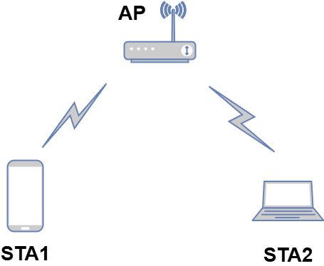
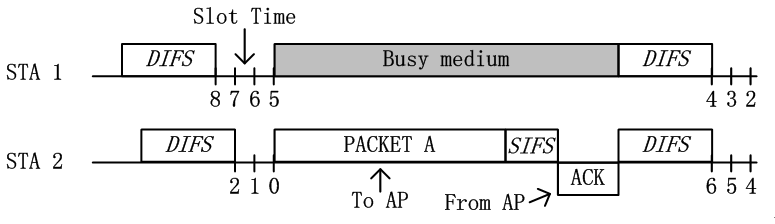
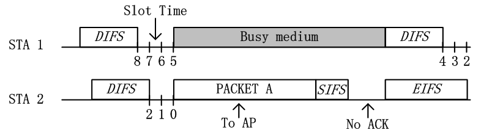
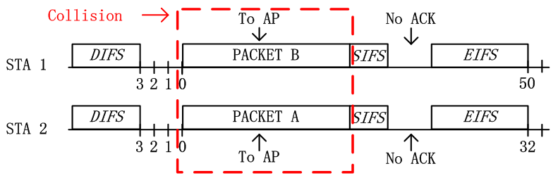
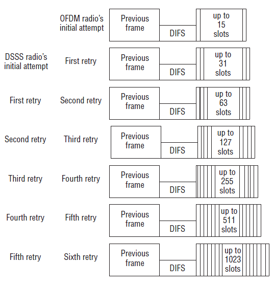
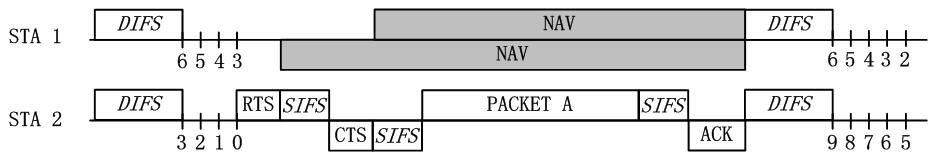
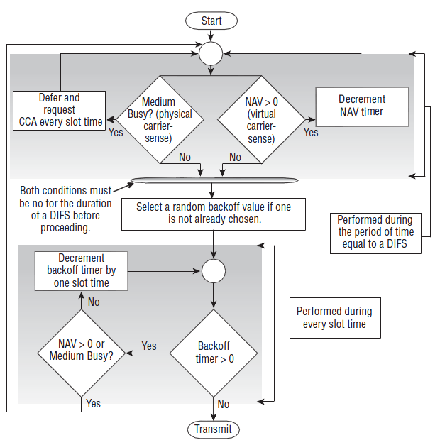
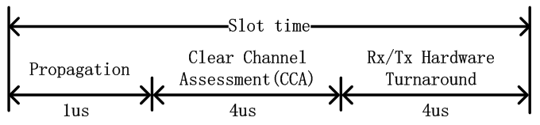

# 802.11协议精读2：DCF与CSMA/CA

转载自: [802.11协议精读2：DCF与CSMA/CA - 知乎](https://zhuanlan.zhihu.com/p/20721272)

## 序言

在初始802.11的MAC层中，分成了两种基本工作模式：

- DCF（Distributed Coordination Function）
- PCF（Point Coordination Function）

其中，由于DCF具有良好的分布式特性，从而应用更加广泛，而PCF模式则较为少用。在802.11e协议中，DCF被扩展为**EDCA模式**，PCF模式被扩展为**HCCA模式**。本文所讨论的主要内容即有关**DCF模式**以及其核心**CSMA/CA机制**。

!!! note

    当前的802.11协议中，除了初始定义的DCF和PCF工作模式外，在802.11e中还定义了EDCA，HCCA，不过本文暂不展开。

## CSMA/CA机制

由于无线信道只有一个冲突域的特性，所以需要设置一种随机接入机制，以避免多个节点同时访问网络所带来的冲突问题，在WiFi协议中，该随机接入机制即是CSMA/CA.

CSMA/CA的全称是Carrier Sense Multiple Access with Collision Avoidance，即载波侦听多路访问／冲突避免。如果熟悉有线网络的可以知道，在集线器与中继器中也会采用一种CSMA/CD的机制，从协议设计的大思路上，两者是类似的，或者说两个都是基于CSMA机制的，而细节上，两者有很多的出入，在本文中，我们尚不细致讨论两者协议的具体差别，而仅仅叙述CSMA/CA的工作机制。

为了方便文中讨论，我们首先假定一个网络拓扑环境如下：

在该拓扑中，存在一个AP，与两个节点（STA 1与STA 2），如果对于无线术语不是很熟悉的话，可以把AP理解成无线路由器。由于无线环境下的广播特性，若STA 1与STA 2同时向AP发送数据，那么就会在AP处发生冲突，从而两者都无法正确接收，最终传输失败。CSMA/CA就是提供一种避免冲突发生的接入规则。

接下来我们需要具体描述CSMA/CA的工作机制，为了方便理解，我们这里首先要给出四个概念：

- **DIFS与SIFS**：该两种都是属于Inter-frame Spacing（IFS），即帧间间隙。DIFS全称为Distributed Inter-frame Spacing，即分布式帧间间隙，SIFS称为Short inter-frame space，即短帧间间隔。在CSMA/CA中，发一个帧之前，都需要 "等待" 一个相应的帧间间隔，比如发送数据之前至少要等待DIFS时间，发送ACK之前需要等待SIFS时间。

!!! note

    在802.11中还存在其他的一些帧间间隔，比如RIFS，PIFS，AIFS，EIFS，本文不再一一赘述。（注：该段落中所提到的等待，不是真正意义上节点什么都不做，具体的功能会在后文相应位置进行描述）

- **Slot Time**：时隙是指的一个时间片段，在CSMA/CA中，节点竞争接入信道之前需要经过相应的随机回退（backoff）过程，其中backoff过程就是由很多个时隙所组成的。

- **Contention window**：竞争窗口是用来让节点选择随机回退计数值（backoff counter）的范围。

- **Backoff**：随机回退过程是指每一个节点在竞争信道时，所经历的随机退避过程。在这一过程开始时，节点首先在竞争窗口中选择一个随机数为基准的随机回退计数值，同时每一个时隙，节点为 "监听" 信道是否空闲，若信道空闲，那么进行一次倒数，即计数值减1，若信道忙，则不进行相应倒数。当该随机回退计数值回退到0时，节点可以发送数据。

!!! note

    1.该段落中所提到的监听，不仅包含了物理监听，也包含了虚拟监听机制，具体功能后文相应位置进行描述。
    2.该文中所讨论的一些概念与有线网络中的概念会存在一些区别，我们这里并不加以细节对比，还请见谅

接着，我们利用时序图描述CSMA/CA的具体工作机制：

当STA 1与STA 2相继存在数据，需要在竞争信道进行发送时，其首先需要 "等待" DIFS时间，若DIFS时间内，信道保持空闲状态，那么就可以进行backoff过程。

若STA 1与STA 2进入backoff过程时，其首先需要从竞争窗口（Contention window）选择一个随机数，在802.11协议中，默认的初始竞争窗口为31，即随机回退计数值的范围即是[0,31]。在上图中，STA 1则是选择了8，而STA 2选择了2。
在backoff过程中，每经过一个slot time，节点会 "监听" 一次信道，若信道空闲，则相应的随机回退计数器的值减1。如上图中，经过3个slot time后，STA 1的随机倒数计数器从8递减至5，而STA 2相应从2递减至0。

当节点的随机倒数计数器倒数至0时，节点竞争获得信道，从而可以发送数据。如上图，STA 2获得信道后，发送PACKET A给AP。在AP接收到数据后，会采用CRC机制对数据进行校验，若校验通过，AP会在SIFS后，反馈ACK确认帧。

当STA 2成功发送完数据， "等待" 了SIFS的时间之后，AP会向节点反馈ACK确认帧。当STA 2成功接收到ACK帧之后，这一次传输完成。

当这一次传输完成后，节点需要再次 "等待" DIFS的时间后，重新开始backoff过程。若节点刚刚发送完数据，那么在backoff过程开始时，需要重新从竞争窗口中选择一个随机数进行倒数。若节点没有发送数据，那么直接从上一次的倒数结果继续倒数。如上图中，STA 1没有竞争到信道，那么其在第二次的backoff过程中，直接基于上次的5直接进行倒数至4。这样的设计目的是为了保证网络传输的公平性。

若在上述的第5步中，AP没有成功接收节点的数据，或者AP对数据进行CRC校验错误，那么其不会反馈相应的ACK给节点。节点在ACK timeout之后，则知道对方没有成功接收数据，该ACK timeout时间在理论分析时，一般与ACK接收时间相等，在具体工程设计中，可能会大一点点。那么发送错误的节点，需要等待EIFS时间才可以再次接入信道，EIFS>DIFS，这样是为了避免一些较差的节点持续争抢信道资源。比如图中STA 2即需要在等待EIFS之后，节点首先进行BEB（该机制我们后面详细讨论），然后重新开始backoff过程，而STA 1则直接在DIFS之后进行backoff。

!!! note

    在这里的描述中，我们所述，在介质忙时，节点通过监听信道，判断介质忙，从而挂起随机回退计数值，这也是很多学术研究中可以看到的常见描述。

!!! note

    图中的EIFS起始点应为STA2中SIFS的起始点（图中错误，暂时没有做修改），即EIFS=SIFS+ACK+DIFS时间。 （EIFS的问题已经单独抽出来讨论了：[802.11协议精读39：EIFS的执行机制](https://zhuanlan.zhihu.com/p/410402175) ）

有关挂起机制，笔者还存在一些理解。我们知道在节点竞争信道的过程中，也有可能会接收数据。由于802.11协议的特殊性，节点只有在完整解调整个数据包之后，经过CRC校验后，才可以完整判断数据帧是不是自己的，从而进行丢包处理。故挂起机制实际上是一种接收机制，即无论信道中的数据帧是不是发给节点的，该节点都需要对此数据帧进行接收，进而判断是否丢弃该帧。故节点由于处于接收状态，从而无法继续进行backoff回退操作，故这里即是处于挂起的动作。

同时在《CWNA教材第三版》中，这里有可能会产生一种误导的理解，即利用Duration字段，即具体采用NAV机制来完成这里挂起随机回退计数值的工作。在该书中，Duration字段用来保留之后SIFS+ACK的时间，而不是用来作为NAV字段保护该数据帧传输过程中挂起其他节点的。换言之，我们前面所提到的ACK timeout的机制，即是采用数据帧中的duration字段来具体设置的。不过除了CWNA书本上的例子外，现实中笔者没有抓到过数据帧MAC头部中Duration存在填充的情况，在这种默认情况下，ACK timeout可能就是SIFS+ACK的标准时间。

## BEB机制

这里BEB机制的全称为 Binary Exponential Back off，即二进制指数退避算法。在CSMA/CA的机制中，还是存在发生冲突的可能性，从而为了避免在CSMA/CA机制下的再次冲突，故这里引入了BEB机制。我们举例进行说明：

与之前所述CSMA/CA过程类似，在 "等待" DIFS后，STA 1与STA 2从各自的竞争窗口CW中选择一个随机数，不过碰巧的是，两者随机到了一样的数值，如图中，STA 1与STA 2都是随机到了3作为随机回退计数值。在经过3个slot time之后，由于两者同时倒数至0，那么意味着两者会同时发送数据，如图中的红色虚线框表示，在AP处由于两者信号互相干扰，从而都无法正确解码，从而CRC校验错误，即发生冲突。在冲突之后，即若AP处CRC校验失败，则不会给任意节点反馈ACK数据包，故两节点在ACK timeout之后（即总共等待EIFS之后，图中EIFS因为DIFS，这里暂未做修改），准备进入下一次竞争。

而在正式进入下一次竞争之前，节点需要对竞争窗口（CW）采用BEB机制，按我们之前所述，在初始竞争时，节点的默认CW范围是[0,31]（假设初始窗口是802.11b机制下，即最大31，在802.11a这种，初始窗口就是15）。而如果在节点数较多的情况下，那么就有可能引发之前我们所述的冲突问题，从而我们需要扩大竞争窗口CW。具体在CSMA/CA中，我们则是采用二进制指数退避的方法对竞争窗口CW进行扩展，即发生一次冲突后，那么CW范围就会从 [0,31] 变化到 [0,63] ，如图中，在冲突之后，STA 1重新随机选择50，STA 2重新随机选择32。在802.11中，一共允许回退6次，第7次不倍增窗口，再次尝试重发，若再次失败，则丢包。

参考CWNA教材，有给出具体每一次回退的CW窗口大小，如下：

## RTS/CTS模式

在DCF模式下，我们还需要知道存在两种子模式：

- Basic模式
- RTS/CTS模式

在之前CSMA/CA讨论中，我们所描述的都是Basic模式，这一章我们理解RTS/CTS模式。

为了更好的理解RTS/CTS模式，我们首先要介绍无线网络中著名的隐藏终端问题 (hidden terminal problem)。

在上图中，还是只有一个AP和两个节点（STA 1与STA 2）。图中蓝色虚线代表STA 1的发送范围，绿色虚线代表STA 2的发送范围。

从图中，我们可以得知，由于两个节点的发送范围无法互相覆盖，从而两者在发送数据时，是无法通过物理监听的方法，探测对方是否有发送数据。从而按照我们之前所述的CSMA/CA机制，STA 1 和 STA 2 一直会误认为信道空闲，从而不断倒数，当计时器到0时，则发送数据，如下图：

在上图中，由于 STA 1 与 STA 2 无法互相监听，即 STA 2 发送数据后，STA 1 还继续进行 backoff 过程，从而继续倒数。当 STA 1 的随机回退计数值倒数至0时，STA 1 也会发送数据。由于 STA 1 与 STA 2 的发送存在重叠区域，即也是发生了冲突，AP无法正确接收数据，即不会反馈 ACK，最终这一轮传输失败。这一轮失败之后，STA 1 与 STA 2 采用 BEB 算法重新选择随机数进行回退，但是由于两者没有办法互相监听，所以很容易再次出现同时传输的现象。所以在隐藏终端的情况下，网络性能最差时是无法传递数据包的，换言之，STA 1 与 STA 2 的吞吐量都趋近于0。

为了解决这个问题，故在 DCF 中，引入了 RTS/CTS 机制。

- **RTS**：Request To Send，即请求发送。RTS帧是一个单播帧，没有加密，其 `duration` 字段中填充包含后续发送过程中总体所需要时间。

- **CTS**：Clear To Send，即信道清除帧。节点在收到CTS后，确认信道是空闲的，可以发送。CTS也是一个单播帧，没有加密，其 `duration` 字段包含除去RTS以及一个SIFS后，发送过程总体所需要时间。

接着我们采用下图解释RTS/CTS具体的工作方法：

在上图中，STA 2 已经倒数至 0，其首先发送RTS数据帧给 AP。若在AP处没有冲突，即AP成功解调出 STA 2 的RTS，AP会在等待SIFS之后发送CTS帧给 STA 2。由于无线信道是一个广播信道，要是帧没有加密的话，那么所有节点都是可以解析其信息的，所以这里AP虽然是发送CTS给 STA 2，不过 STA 1 也可以解析该CTS信息，这也是很多书上写，RTS/CTS都是一个广播过程的原因。

当 STA 1 接收到CTS之后，该CTS不是我所请求所获得的，或者说，该CTS不是对应发给我的CTS。从而 STA 1 会将CTS数据帧的duration给提出，并设置在自己本地的 NAV（Network Allocation Vector）上。若NAV没有倒数到0，那么其会主动悬挂其随机回退计数值，在NAV没有倒数到0之前，其随机回退计数值不再继续倒数。

当 STA 2 接收到CTS后，其发现该其是之前发送RTS的反馈。故节点已知信道空闲，在等待SIFS后，STA 2 发送数据。当数据传输完成之后，AP向 STA 2 反馈ACK，从而最终完成一次传输。

RTS/CTS工作机制对应的时序图如下：

Remark: 图上画错了，STA 1 在重新backoff的时候，从3直接开始倒数而不是6。

在上图中，我们可以发现，NAV的部分和我们在CSMA/CA的流程图中的Busy medium是一样的，其区别在于一者是物理载波监听（即之前的Busy medium是由于物理载波监听所引起的），而另者是虚拟载波监听（即NAV是由虚拟载波监听所引起的），在下一节，我们会讨论物理载波监听与虚拟载波监听机制。

在实际的路由器中，RTS/CTS模式不是以开关的形式存在，而是以 `RTS_threshold` 的形式存在的。RTS/CTS另外一个思维就是 **"采用小的数据包碰撞，来避免大的数据包碰撞"** ，从而如果数据包太小，那么则不需要采用RTS/CTS机制。设置RTS_threshold的范围一般为 `2347`，其单位是byte，即如果数据包大小如果大于 `2347` byte，那么才会采用RTS/CTS模式，在现实应用中，可以根据具体的情况，设置一个最适合的值。

!!! note

    在本段中，我们所述RTS/CTS着重解决隐藏终端问题，同时RTS/CTS也是利用小数据包碰撞来避免大数据包碰撞的方法，该方法对于在没有隐藏终端，但是节点数很多的网络中，也时很有效果的。同时，本章节中，我们提到采用RTS/CTS模式来设置NAV，这里需要强调的是，RTS/CTS可以设置NAV，但是NAV不是仅仅只能用RTS/CTS来设置，只要数据帧MAC头部的duration字段有数值，那么就可以设置NAV，该机制在802.11协议中，有非常广泛的应用，比如 PCF 的Contention Free周期，EDCA中的**TXOP机制**等。

## 物理载波监听和虚拟载波监听

在这一章节，我们讨论物理载波监听和虚拟载波监听机制，两者是在CSMA/CA过程中同时使用的，在《CWNA第一版》一书中，对此有较好的描述：

从该图中，我们可以明显看出，物理载波监听和虚拟载波监听是同时执行判断的，其中只要有一个是出于Busy状态，那么就不会触发随机回退计数值减1的过程，换言之，即是挂起了随机回退计数值。从该图中，我们可以明显得知，**虚拟载波监听就是对应的NAV机制**，而**物理载波监听则是对应到了CCA（Clear Channel Assessment）机制**。下面我们着重关注物理载波监听的CCA机制：

在CSMA/CA中，CCA由**能量检测**和**载波检测**一起完成：

- **能量检测(Energy Detection)**：

    直接用物理层接收的能量来判断是否有信号进行接入，若信号强度大于 `ED_threshold`，则认为信道是忙，若小于 `ED_threshold`，则认为信道是闲。同时该 `ED_threshold` 的设置与发送功率有关，比如发送功率大于100mW，那么`ED_threhold` 约为 `-80dBm`，发送功率在50mW至100mW之间，那么 `ED_threshold` 应该为 `-76dBm`。不过至于具体的数值，需要查看其具体所对应版本的802.11协议。

- **载波侦听(Carrier Sense)**：

    载波监听的方法指的是用来识别802.11数据帧的物理层头部（PLCP header）中的preamble部分。简单的说，802.11中的preamble部分采用特定的序列所构造，该序列对于发送方和接收方都是已知的，其用来做帧同步以及符号同步。在实际监听过程中，节点会不断采样信道信号，用其做自相关或者互相关运算，其中自相关在基于OFDM的802.11技术中常用，比如802.11a，而互相关在基于DSSS技术中常用，比如802.11b。与能量检测类似，相关计算值需要与一个阈值进行判断，若大于，则认为检测到了一个信号，若小于则没有检测到。

协议中规定，两种检测方式同时采用，且只要两者检测方式中，有一种判断信道是busy的话，那么就认为信道是busy的，只有两者都认为信道空闲时，那么再判断虚拟载波监听机制是否为0，以上条件都满足时，那么才可以进行backoff倒数。

## DIFS，SIFS与Slot time

最后我们浅谈下 `DIFS`，`SIFS` 与 `Slot time` 的具体功能。在前面的叙述中，我们使用 "等待" 这一词来描述节点在 `DIFS` 与 `SIFS` 过程中的动作，同时我们描述 `slot time` 内持续监听信道。在实际过程中，`DIFS` 与 `SIFS` 不是纯粹的等待动作，而 `slot time` 也不是整个周期都是监听信道。我们首先谈谈 `slot time` 的构造，由于笔者这一部分没有详细翻阅协议，参考一篇论文《WiFi-Nano: Reclaiming WiFi Efficiency Through 800 ns Slots》，其举例一个9us的slot time的组成如下：

即Slot time由

- 电磁波传播时延（Propagation），
- 信道检测CCA时间（Clear Channel Assessment）
- 以及天线的发送/接收切换（Rx/Tx Hardware Turnaround）

组成。

故这里就明确回答了，在一个slot time内不是整个周期都在监听信道，而只有CCA时间这一部分在监听信道。而最后一个天线发送转换也好理解一些，这里我们在说CCA监听信道的过程中，除了为了之前我们所述的backoff过程，实际上节点也在利用CCA来监听，是不是有给我的数据包。如果该数据包不是给我的，那么CCA监听结果就是忙，然后等一个slot以后继续监听。如果监听该数据包是给我的，那么就直接转换到接收状态，而不是继续进行每一个slot监听的动作了。

同时，这里我们之所以将 `DIFS`，`SIFS` 与 `Slot time` 放在一起讨论，是由于 $DIFS = SIFS + 2*Slot_time$ 。

SIFS的功能我们可以理解成，包含天线发送接收转换，以及上层处理数据所需要的延迟时间。

而DIFS中，由于正巧包含了两倍的Slot time，所以很大程度上，在DIFS内，应该执行了两次信道监听过程，但是这两次的监听过程没有触发backoff。只有监听到连续两次信道空闲后，那么DIFS之后才会进行backoff过程，该设计思想应该是源于 **P坚持-CSMA** 的，同时，这个思路也是和我们在讨论物理载波监听和虚拟载波监听中的插图所符合的。类似的，在802.11协议中，其他的部分帧间间隔也是基于slot time和SIFS计算所得，比如

$PIFS = SIFS + SLOT$

$EIFS = ACK time + SIFS + DIFS$。

笔者重新查了下协议，在协议中SIFS和Slot time的组成被定义如下：

$aSIFSTime= aRXRFDelay（射频延迟）＋aRXPLCPDelay（物理层头部接收延迟）＋aMACProcessingDelay（MAC层处理延迟） + aRxTxTurnaroundTime（发送接收天线转换时间）$

$aSlotTime= aCCATime（CCA时间）＋aRxTxTurnaroundTime（发送接收天线转换时间）＋aAirPropagationTime（传播延迟）＋aMACProcessingDelay（MAC层处理延迟）$

故基本是和我们之前的描述一样的，细节上还增加了几项，故这里标注一下。

注：以上就是笔者对于DCF与CSMA/CA的基本理解，大部分内容都是参考笔者前一篇资料总结中所列之参考文献。上述表述中，也许存在一些错误，还请见谅，也有一些细节，并没有在这一篇中展开叙述，有空笔者再继续进行整理。同时，笔者所学有限，若文中出现了的错误的地方，还请指出，谢谢。