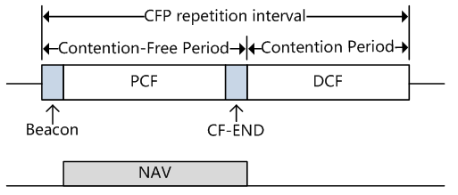
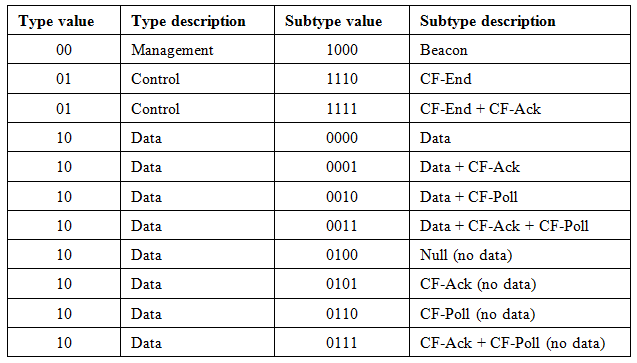

# 802.11协议精读4：PCF工作模式

转载自: [802.11协议精读4：PCF工作模式 - 知乎](https://zhuanlan.zhihu.com/p/20750579)

## 序言

在前面我们叙述过，在802.11的MAC层中，分成了两种基本工作模式：

- DCF（Distributed Coordination Function）
- PCF（Point Coordination Function）

我们已经介绍过了DCF的工作模式，而PCF模式当前只有协议中进行了规范，而在实际产品中几乎很少见到。所以就像在 802.11 权威指南和 CWNA 书本中所述一样，对于PCF的机制仅仅是协议规定，而几乎没有产品，所以纯粹对协议希望有深入了解的话，那么才需要对此进行阅读。这里仅仅是将笔者读协议以及相关资料中，所理解的PCF工作模式进行整理。

## PCF简介

PCF 的全称是 `Point Coordination Function`，即`点协调工作模式`。在 802.11 的MAC层协议结构中，PCF 是基于DCF之上的协议，同样的还包含 EDCA 和 HCCA 两种模式，后两种主要是为了QOS进行设计的，具体如下图

由于 PCF 是以 DCF 作为基础扩展的，所以 PCF 与 DCF 是可以兼容工作的。在 PCF 模式中，两者的兼容实际上是基于一种交替工作的机制，即 PCF 和 DCF 各占据一段时间，交替进行工作。该交替周期即是 CFP 重复周期（CFP repetition interval），在该周期内，包含CFP和CP两个部分，如下图

- `无竞争时间（CFP）`：Contention-Free Period，即 `CFP时间` 是为了PCF工作所设定的一段时间。该时间是利用虚拟载波监听（NAV）的机制进行保护的，该NAV是由Beacon帧进行设置，并由 CF-END帧 用来终止。

- `竞争时间（CP）`：Contention Period，该CP时间是用来给 DCF 工作的一段时间，在该周期内，协议按照DCF的模式进行工作。

这里我们还需要更细一些说明该 CFP 时间 设置的原理。在之前描述DCF模式中，我们基本已经描述了NAV的工作机制，其主要是利用无线数据帧MAC 头部中的 Duration 字段进行设置。在CFP准备启动的时刻，AP首先利用 beacon 帧设置 NAV 时间至`CFPMaxDuration`，其具体设置方案如下：

- 利用数据帧的 MAC 头部中的 Duration 字段，设置 `CFPMaxDuration`。标准的 `Duartion` 字段共有16个字节`[0:15]`，其中倒数2个字节，即`[14:15]`是标志位，且其存放方式应该是属于小端模式的，即后面的是高位，前面的是低位。如果是CFP设置NAV时，对应第14位置0,第15位置1，其余各位都是0。故解析出来，那么NAV的时间即设置为 $2^{15}=32768 \, microsecond$。其对应结构如下图：

- 除了利用 MAC 头部的 Duration 字段，在 CFP 对应的 beacon 帧中，还有一个 `CF Parameter Set` 字段。利用该字段中的CFP MaxDuration，也同样设置该参数。在 802.11 中设置两次 CFPMaxDuration 参数的原因在于，是在于避免无法识别 `CF Parameter Set` 字段的节点，只要其能识别标准MAC头部的 Duration 字段，那么其也会被置为 NAV 状态，从而无法争夺信道的使用权。

由于这里NAV是被设置为`最大时间`，所以 NAV 的技术与之前我们描述在 DCF 的 RTS/CTS 模式下存在差别。在 DCF 中的 RTS/CTS 模式下，NAV 是通过倒数置0，从而释放信道。在PCF模式中，NAV的释放是通过 CF-END帧，按照笔者记忆中，中间传递的各个帧中也会重复将 NAV置为最大，只有在最后的 CF-END 中，才会将 duration 字段写成0，从而结束 NAV 时间，换言之，NAV时间的设定是可以被覆盖的。CF-END的帧结构如下：

如上图，CF-END 是一个广播帧，其类型是`控制帧`，子类型是 CF-END，而且 Duration 部分设置为0，其余该帧内没有什么特殊的地方了。

通过以上的机制，PCF 能够很好的与 DCF 进行兼容。在下面的内容中，我们开始解释 PCF 具体的工作模式。

## PCF工作模式

在这一段中，我们叙述PCF的具体工作模式。PCF的主要思想为：

**"AP充当中心协调控制器（PC）的角色，根据其内部的轮询表（polling list）依次轮询与之连接的节点（CF-Pollable STA），看其是否有数据待传。在CFP时间内，节点由于NAV机制，故无法主动竞争信道。故除非基站轮询节点，要求其反馈数据，节点不可以主动进行传输动作。"**

在上述描述中，已经包含了，在 PCF 中的两个新的角色：

- PC（point coordinator）：即点协调器，一般情况下，都是由 AP 做点控制器。

- CF-Pollable STA：支持PCF机制的节点。

在 PC 身上，我们还会引入轮询表（polling list）的概念。在 PCF 中，PC 按照轮询表的顺序，按照升序，依次对节点进行轮询。在免竞争期间，除非基站以轮询帧提出要求，否则工作站不得进行传输数据。轮询具体会采用 CF-POLL 帧来执行，节点接收到 CF-POLL 之后，向PC反馈数据。在标准的 PCF 中，一次 CF-POLL 只会反馈一个数据帧。只有在启用 APSD（Automatic Power Save Delivery）的设计下，才会使用其他的请求方式（Trigger Frame），才会一次请求，反馈多个数据帧，不过这里由于我们没有讨论节能方面的内容，故不展开讨论。

并且在 PCF 中，还会引入多种新的帧结构，比如前面叙述中出现的 CF-END，在 PCF 中还存在其余的各种帧如下：

- **仅PC发送**：

  - Data＋CF-Poll
  - Data＋CF-ACK＋CF-Poll
  - CF-Poll
  - CF-ACK＋CF-Poll

- **PC与CF-Pollable STA发送**：

  - Data
  - Data＋CF-ACK
  - Null
  - CF-ACK

接下来，我们还是假设讨论与 DCF 同样的拓扑，并且在该PCF讨论中，我们同时关注上下行流：

由于 PCF 不同种帧类型其功能会有一些不同，为了说明清楚，我们选取几个典型的工作流程，进行具体的示例说明，其余的一些工作流程可以类比得出。

### CF-Poll -> Data -> CF-ACK 工作流程

1. 首先 AP 发送 Beacon，利用其中的 `duration` 参数，将所有节点设置成 NAV 状态。（PS：在 CFP 时间的设置上，前面我们描述过，也可以利用 beacon 帧中的 `CF Parameter Set`，这里为了描述的方便，所以就不再强调了，还请见谅）

2. AP 本地没有发往节点 STA1 的缓存数据，故 AP 直接发送 CF-Poll，让节点可以上传数据。

3. 节点发送 DATA 给 AP。

4. 最后 AP 反馈 CF-ACK 给节点，从而结束一次传输轮询。

上图是最简单的请求反馈过程，除了首先是由 AP 触发这次传输以外，其余基本和 DCF 的工作是相同的。这里我们还需要注意的是，若 AP 成功接收了 Data，那么其反馈 ACK 信息。若 AP 没有成功接收节点的DATA，那么可能会出现两种情况：

- STA1 向 AP反馈 DATA 过程中发生错误，从而 DATA 无法通过 CRC 校验。这个情况下，AP 不会反馈 CF-ACK，直接轮询下一个节点 STA2。

- AP 向 STA1 发送 CF-Poll 帧的过程中发生错误，从而 STA1 根本就不知道 AP 有要求自己反馈上行数据，从而 STA1 是不会主动反馈数据的。在该情况下，AP 会等待 PIFS 时间，若 PIFS 时间内，没有检测到节点存在反馈，那么 AP 就认为这次传输失败，跳过该节点，继续轮询下一个节点，具体如下图：

PIFS 的时间实际上是由一个 SIFS 和一个 SLOT 组成，即 $PIFS=SIFS+SLOT$。结合我们在DCF部分论述Slot和SIFS具体组成的内容，这里之所以PIFS这样设计，实际上是利用Slot里面的CCA机制，AP利用该CCA判断是不是存在反馈帧，若存在反馈帧，那么就进行接收。这里并没有采用DCF中的ACK timeout的简单机制来判断是否反馈，而是具体采用这种CCA检测的具体机制，是除了这里反馈CF-ACK以外，还有可能反馈其他类型的帧，比如CF-ACK +CF-Poll等，具体内容我们在后面进行叙述。

### DATA+CF-Poll -> Data+CF-ACK -> CF-ACK工作流程

第二种情况较为复杂一些，我们先描述其时序图：

1. 首先 AP 发送 Beacon，利用其中的`Duration`参数，将所有节点设置成 NAV 状态。

2. AP 本地存在发往节点 STA1 的缓存数据，故 AP 将自己的 DATA 以及 CF-Poll 同时发送，让节点在接收数据后，可以上传数据。

3. 节点发送 DATA+CF-ACK 给 AP，其意在首先确认之前AP发送的下行数据，再反馈自身的数据给AP。

4. 最后 AP 反馈 CF-ACK 给节点，从而结束一次传输轮询。

我们现在讨论上面工作机制的一些细节内容。

- 首先叙述 **AP 缓存节点数据的机制**，在 PCF 模式以及节能模式下，缓存机制都会被有效利用起来，这里的缓存是指公网发往节点的信息，由于没有及时传给节点，从而缓存在AP身上。该缓存信息在每一个 beacon 周期内，也会在其 `TIM字段` 内利用 `Bitmap` 信息进行标识。**Bitmap 是一种映射的数据结构**，其中每一个位就代表一个节点，即每一位都是和节点的二层地址进行关联。若该位为 **1** 时，那么代表该节点存在缓存数据，若为 **0**，那么对应没有缓存数据。故节点在接收到beacon帧后，就知道在这个周期内，我会不会收到来自与AP的数据。

- 其次我们需要强调的是，这里的 `DATA+CF-Poll` 是一个帧，不是分别的两份帧。这里实际上是对应到一种特殊类型的帧，这里不同帧的类型实际上是通过在 MAC头 部第一个字段 Frame control 下的两个字段：Type 和 SubType 组成的，如下图

我们总结在PCF中，type有关的具体相应参数如下：

!!! note

    CF-ACK 与标准的 ACK 帧不同，标准的 ACK 为控制帧，而 CF-ACK 为数据帧。

- 最后我们需要理解，为什么在 PCF 这里协议选择用一个帧的功能来代替分别传输两个帧，其主要原因就是**节省时间**，这里不仅仅节约了额外帧交换中需要等待的 SIFS 时间，也减少了单独传输帧所花费的时间。比如说对比 DCF 中执行类似 DATA+CF-Poll 这样的发送流程，其发送大致为 DATA+SIFS+ACK+CF-Poll+SIFS+DATA+ACK 这么长的流程才可以完成，而采用合成帧的形式，那么就简单很多，并且对性能有好的提升。

### CF-Poll -> Data -> CF-Poll + CF-ACK -> Data 工作流程

在了解前面的内容之后，我们描述另外一种合成的帧，**CF-Poll+CF-ACK**帧，还是首先描述其工作流程：

1. 首先 AP 发送 Beacon，利用其中的duration参数，将所有节点设置成NAV状态。

2. AP 通过 CF-Poll 请求节点 STA1，让 STA1 可以上传数据。

3. 节点 STA1 发送 DATA 给 AP。

4. AP 发送 CF-Poll+CF-ACK，其中 CF-ACK 是发给 STA1 用以确认其发送的数据，CF-Poll 是用来请求下一个节点发送数据，即发给 STA2 用以请求数据。

5. 节点 STA2 反馈数据给 AP。之后的工作流程我们这里省略。

大体上和之前的工作模式是类似的，唯一区别的是 CF-Poll+CF-ACK帧，该帧既是发送给 STA 用来做 CF-ACK 确认，又是发送给 STA2 用以请求数据，而我们知道 802.11 帧的目的地址只有一个，所以这里是存在疑惑的，目前还没有在协议中发现具体描述这种帧结构的部分，目前猜想应该是类似 CF-END+CF-ACK 帧的结构：

在无线帧中，ACK 帧是没有源地址，只有目的地址的，这点 ACK 和 CTS 同样。而在上图所示结构中，除了在 ACK 中存在的 RA（Receive address）地址，还存在额外的一个 BSSID 地址。故我们初步猜测是，RA是用来作为ACK反馈的目标地址，在我们所示流程中，即为 STA1 的地址。而用来作为 CF-Poll 请求的目的地址可能是放在 BSSID 这个位置中，标准的 BSSID 是用来表示 AP 相应的地址（即SSID具体对应的 BSSID 地址），但是这里由于目的地是一个节点，故在 CF-Poll+CF-ACK 帧中，这里也许就是放的 Polling 的目的地址。即这里猜想在 CF-Poll+CF-ACK 这个帧中，该处还是一个地址，不过不是 BSSID，而是Polling的目的地址。从而才可以利用一个帧，同时向两个节点传达目的。

### CF-END与CF-END+CF-ACK

在 PCF 的无竞争周期最后，是利用 CF-END 帧来作为终止信息的。其中 CF-END 也有两种可能性，即 CF-END 和 CF-END+CF-ACK。同时，由于其可以终止 CFP 时间的特性，故协议中，这两种帧的类型都被定义为控制帧，与其余的PCF帧存在一定的区别。由于在该帧中的 duration 字段设置为 0，并且这是一个**广播帧**。当所有节点接收到该帧后，修改自己的NAV时间为0，从而即是结束利用虚拟载波监听NAV机制所保护的无竞争时间，转入竞争接入状态。具体该帧结构如下：

其中 Duration 字段为0，RA字段为广播地址，而BSSID字段为 AP 上SSID所对应的 BSSID 地址。CF-END 和 CF-END+CF-ACK帧结构一样。

综上所述，我们阐述了有关PCF工作模式中，具有典型意义的几个工作流程，由于PCF的帧类型总数较多，所以能组合成多种不同的具体工作流程，所以我们就没有完整列举了。其余的情况应该都可以基于以上几个典型的情况进行类比。由于 PCF 的整理还是较为繁杂，所以难免会存在不清楚的地方。以上叙述中，如果有不清楚，或者存在有错误的地方，还请见谅。