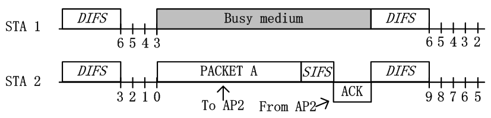

# 802.11协议精读5：隐藏终端和暴露终端

转载自: [802.11协议精读5：隐藏终端和暴露终端 - 知乎](https://zhuanlan.zhihu.com/p/20780796)

## 序言

在无线通信中，有两个典型的问题，即`隐藏终端`和`暴露终端`问题。在 802.11 中，这些问题也是存在，同时也衍生出了一些新类型的隐藏和暴露终端问题。在前面描述DCF模式中，我们已经谈论了的隐藏终端问题。

实际上，**隐藏终端** 和 **暴露终端** 都是由于 CSMA/CA 中所采用的 **LBT机制** 所引起。隐藏终端是由于监听到的信道空闲而不是真的空闲，故引发冲突。而暴露终端是由于监听到的信道忙而不是真的忙，故其可以传输而不传输。

在这里，综合之前的论述，我们对一般性的隐藏终端和暴露终端做一个简单的整理。

## 隐藏终端问题

**隐藏终端问题**可以简单定义为：**节点之间无法互相监听对方。但当其不可以同时传输时，其同时传输，从而导致冲突发生。隐藏终端在单个AP（或者单个Receiver）时就有可能发生。**

我们基于以上拓扑讨论基本的隐藏终端问题，在该拓扑中，STA1 与 STA2 为两个节点，这两个节点都是关联在 AP 身上。图中蓝色虚线代表 STA1 的发送范围，绿色虚线代表 STA2 的发送范围。

由于图中 STA1 与 STA2 发送范围无法互相覆盖，即无法通过物理载波监听的方法，探测对方是否有发送数据。从而 STA1 与 STA2 可能会误以为信道空闲，从而同时发送，继而造成冲突。

如上图所述，根据 DCF 中 CSMA/CA 的工作机制，STA1 与 STA2 在等待 DIFS 之后，分别选取一个随机数进行 Backoff。STA2 由于随机数选择较少，从而首先倒数至 0，并发送数据。当 STA2 发送数据后，由于 STA1 监听不到 STA2 已经占用信道，其依旧误以为信道是空闲的，从而继续进行 backoff。当 STA1 的随机回退计数值倒数至 0 时，STA1 也会发送数据。

由于 STA1 与 STA2 的同时发送，即 AP 接收时存在重叠区域，即也是发生了冲突，最终这一轮传输失败。当这一轮传输失败之后，STA1 与 STA2 采用 BEB 算法重新选择随机数进行回退，但后续过程中两者依旧无法互相监听，所以很容易再次出现同时传输的现象。在隐藏终端的情况下，网络是近似瘫痪的，换言之，STA1 与 STA2 的吞吐量都趋近于0。

PS：除了 RTS/CTS模式 是在协议层面解决隐藏终端问题，实际情况下还有很多解决隐藏终端的问题，比如增加客户端功率，消除中间的障碍物，将造成隐藏终端问题的节点或者AP移动个位置之类的，实在不行的话，那么控制下原始 AP 的功率，再添加入一个新的接入点也行，不过最后个方法需要小心一些，因为搞不好会引起下面所述的暴露终端问题。

## 暴露终端问题

暴露终端问题可以简单定义为：**节点之间能够互相监听对方。但其可以同时传输时，其不传输，从而造成浪费。暴露终端在多个AP（或者多个Receiver）时才有可能发生。**

我们基于以上拓扑讨论基本的隐藏终端问题，在该拓扑中，STA1 与 STA2 为两个节点，其中 STA1 关联在 AP1 上，STA2 关联在 AP2 上。图中蓝色虚线代表 STA1 的发送范围，绿色虚线代表 STA2 的发送范围。

图中 AP1 处于 STA1 的覆盖范围内，而不再 STA2 的覆盖范围内。AP2 处于 STA2 的覆盖范围，而不在 STA1 的覆盖范围内。换言之，AP1 只能接受到 STA1 的数据，AP2 也只能接收到 STA2 的数据。当 STA1 与 STA2 同时发送时，接收节点 AP1 或者 AP2 处均不会发生冲突，故其是可以同时传输的。但是由于这样的拓扑特殊性以及 DCF 中 CSMA/CA 的工作机制，造成 STA1 与 STA2 无法同时传输，该问题则是暴露终端问题。

在 CSMA/CA 中，接入是遵守 LBT（Listen Before Talk）机制的。我们在 DCF 的介绍中所述，每一个节点在接入信道之前需要进行 backoff。在该过程内，若信道空闲，则每经过1个slot，随机倒数计数器进行一次倒数。若信道非空闲，则节点不会对随机倒数计数器进行倒数，并对其进行悬挂。只有当其倒数至0时，才可以发起传输。其中信道空闲与否是通过载波监听机制进行判断的，而在DCF中，存在物理载波监听和虚拟载波监听两种模式，这两种监听方式都有可能引起暴露终端问题，以下我们分两种情况进行讨论。（有关 DCF 的接入过程，详细内容请查阅之前的文档）

### 物理载波监听引起的暴露终端

如上图所示，由于 STA1 与 STA2 可以互相监听。由于 STA2 选择了较小的随机数进行倒数，从而其最先倒数至0，并进行发送。当 STA2 首先发送数据包给 AP2 后，STA1 监听信道为忙状态，从而无法发送信息。故根据拓扑而言，STA1 是可以传数据给 AP1 的，但是由于监听 STA2 正在传输，导致信道忙，故 STA1 悬挂随机倒数计数器，无法继续倒数，从而无法传输。

这里实际上我们还可以更深入了解一下，实际上 STA1 为什么需要在别人传输的时候，悬挂自己的随机倒数计数器。在 CSMA/CD 中，实际上是没有悬挂过程的，只有在 CSMA/CA 中才存在。在 CSMA/CD 中，若信道忙，节点就不停的去监听信道，一旦发现空闲就传输。而在 CSMA/CA 中，节点在中间实际上不是监听信道，而是接收数据。其主要原因在于，STA1 在检测到 STA2 正在传输造成信道忙时，其立刻开始接收该 STA2 的数据，因为 STA1 不知道该数据是否是发给自己的。只有当完整接收数据，CRC 校验通过后，STA1 才可以检查帧 MAC 头部所对应的目的 BSSID 地址，看是否是自己的数据包，若不是才可以丢包。换言之，CSMA/CA中，悬挂实际上是为了接收，从而导致的现象是悬挂而已。

### 虚拟载波监听引起的暴露终端

如上图所示，在暴露终端场景中，若 STA2 不仅选择了较小的随机数进行优先倒数，并且其发送的数据包是RTS数据包。当 STA1 识别到该RTS数据包后，其就会被设置为 NAV 状态，无法在后面的过程主动竞争信道，进而无法传输。与之前描述用RTS/CTS解决隐藏终端问题时不同，在解决隐藏终端问题中，NAV 是由 AP 所反馈的CTS帧所进行保护。而这里由于 STA1 与 STA2 能够互相监听，换言之，在暴露终端情况下，STA1 的 NAV 是被 STA2 所发送的RTS帧进行保护的。在 STA1 被 NAV 保护后，其也无法传输，最终导致暴露终端问题。