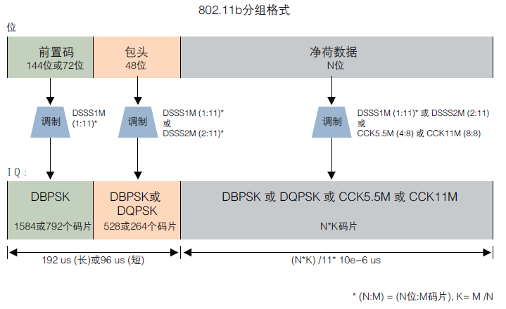
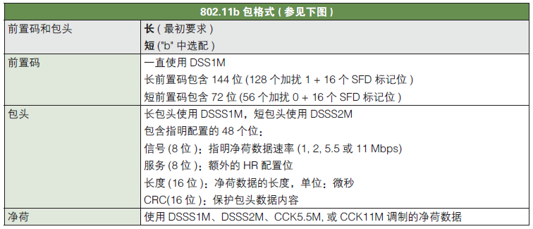
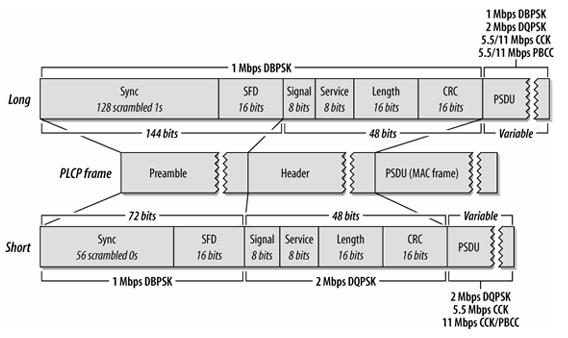
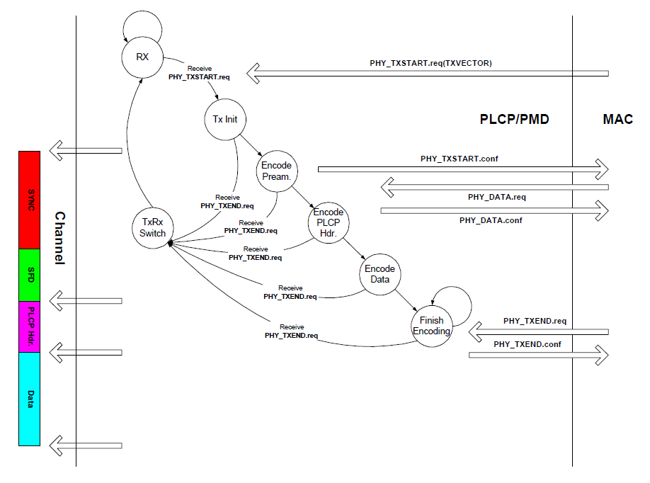
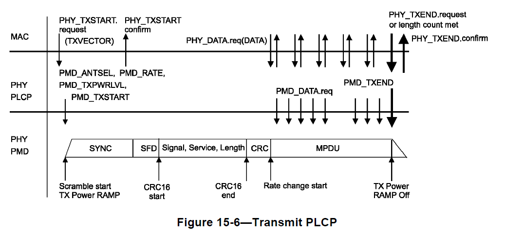
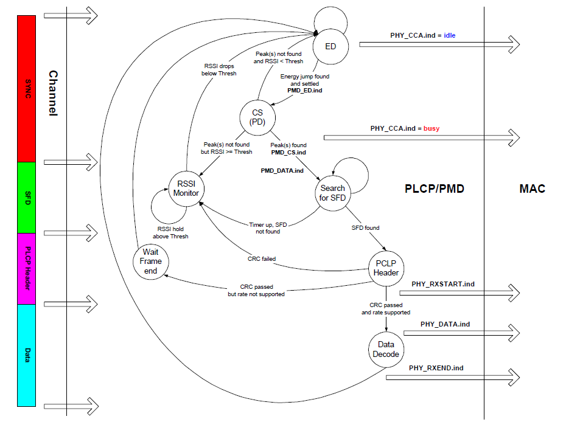

# 802.11协议精读6：802.11b的发送过程与接收过程

转载自: [802.11协议精读6：802.11b的发送过程与接收过程 - 知乎](https://zhuanlan.zhihu.com/p/21483155)

## 序言

802.11 目前都还是属于一个 半双工 的协议版本，所以在其设计接入过程时，不仅仅要考虑避免由于共享信道造成的冲突问题，同时也要考虑 发送和接收的切换 问题。在基本的两种工作模式：DCF 与 PCF 中，PCF 是采用 AP 中心控制的方法，只有当 AP 去polling节点的时候，节点才会变成发送状态，否则节点都是出于接收状态，而DCF模式中，由于节点能够主动竞争信道，那么发送和接收的切换则变得较为复杂。参考 [IEEE 802.11 Tutorial（Mustafa Ergen）](http://staff.ustc.edu.cn/~xinming/Wireless%20Networks/ME-Wireless%20Communications%20and%20Networks/802.11-tutorial.pdf)，我们对这一块进行整理。在该资料中，整理了 802.11b 和 802.11a 两种工作模式，前者是基于 DSSS 的，后者是基于 OFDM 的，对于 802.11n/ac 以及其他的新协议，这一块过程上应该是更复杂一些，但是这份整理中还未涉及。我们这里首先整理 802.11b 工作模式下的相关内容。

## 802.11b：物理层头部

为了理解802.11b中的发送和接收过程，我们首先需要对其物理层的头部进行一定的理解。在802.11b的物理层头部前面有两个部分，一个 PLCP preamble，一个 PLCP header。如下图（图参考自泰克的文档）

其各个部分对应的功能如下：

其中前置码 （preamble）是采用最低速率进行发送的，也就是 `DSSS 1M`，对应 barker 码的最低速率。Header 部分也是用最低速率，或者次低速率进行发送的。sync 是用来做帧同步的，SFD 是用来找数据帧起始的。然后 header 里面是具体的一些设置。其具体的结构可以进一步展开：

在 802.11b 的物理层头部最先是 `preamble` 部分，在 preamble 部分包含两个部分，`sync` 和 `SFD`，其中 sync 是用来做帧同步的，也就是发现信道中有没有数据帧，SFD 是作为帧起始标识的。

在 sync 中有分为长和短两个部分，一般也直接成为 `长preamble` 和 `短preamble`。其中 **长 preamble 是用作在覆盖范围较大（速率较低）**的模式下，**短 preamble 是用来覆盖范围较小（速率较高）**的模式下。sync 如果是长训练序列全部填充为逻辑1，并且由于底层是 DSSS 1M 的，换言之这些逻辑 1 都需要经过 11 位 barker 码的扰码的。如果 sync 是短训练字段的话，那么填充为逻辑 0，也经过相同的扰码处理，这里一个采用逻辑 1 和逻辑 0 也是为了避免冲突。SFD 部分是 `0000 0101 1100 1111`，一旦识别到这个序列，就代表发现了一个数据帧。

在 802.11b 的 PLCP header 部分，主要是做一些传输参数设置的。第一位是`signal`位，该位主要是告知 payload 的传输速率的，其中在 802.11b 一共只有4个速率，而且我们关注到，这里一共有 8 位，也就一共可以表明 2^8 个速率，但是实际中很多位是没有使用的。第二个专注长度位，即 length，这里的单位是 **us**，是**payload传输的时间**，这里的长度是采用 16 位的无符号整形。后面那个CRC位是用作校验位的，用来判断物理头部有没有错误。最后剩下来的就是 Service 位，其全称是`HR配置位`。这里的HR指的是High Rate，原因是由于最开始的 802.11 协议即是基于 DSSS/FHSS 技术的，而 802.11b 实际上也是基于同样的技术，但是由于其扩频码以及调制技术之类得到的升级，同时为了与传统的802.11协议做区别，所以命名即为`802.11b HR/DSSS`模式。其余还有一些内容可以参考（有关802.11b物理头：整体结构，有关802.11b物理头：preamble部分，有关802.11b物理头：Header部分）。接下来我们描述具体的 802.11b 中的发送和接收过程。

## 802.11b: 发送过程

上图描述了 802.11b 的发送过程，左边一部分是描述帧的各个部分与状态机的对应关系，中间主要是发送模式下，各个状态的转移过程，右边描述是PHY与MAC层的交互过程。接下来，我们按序描述一次发送过程：

1. 初始状态是 **Rx**（接收状态）。

    若 MAC 通过 PHY_TXSTART.req 方法对 PHY 进行通知，则 STA 从 RX 状态转移至 Tx Init 状态，代表有数据需要被发送。在DSSS模式下，参数 TXVECTOR，一般包含了（LENGTH，DATATRATE，SERVICE，TXPWR_LEVEL）这4个具体的变量值，主要是设定数据的长度，速率，扰码的初始化序列，以及发送功率这些，这里先不展开了。若没有 MAC 层下发的通知，则节点还保持在 Rx 状态，代表没有上层数据的情况下，节点进行数据的发送。同时这里需要注意的是，我们在 DCF 竞争过程中，提到节点在不停的监听信道，只有信道空闲的时候，才会进行发送数据，所以 Rx 模式的状态转移到自己，也存在这样的一种情况，即不停的尝试接收。

2. 当状态切换为了 **Tx Init** 状态后，

    PHY 层会向 MAC 层反馈 PHY_TXSTART.conf（这个 conf 指的不是配置，而是确认(confirm)，所以在协议中目前是采用 PHY_TXSTART.confirm 这种表述，避免歧义）。这里可以注意到，Tx Init 状态下面可以转移到两个状态，一个是 `Encode Pream.`状态，一个是 `TxRx Switch` 状态。我们关注后者，即在该图表述中，在发送过程中任何一个状态都有可能因为接收到 MAC 层发送过来的 PHY_TXEND.req 信息，直接转换到 TxRx Switch 状态，无论发送过程是否完全结束，所以在后续的几个状态下，都可以直接切换到 TxRx Switch 状态，该 TxRx Switch 可能是一个逻辑开关，也可能是一个物理的射频天线开关，这里节点目前是发送状态，即天线是可以发送的，一旦进行天线切换，那么就转换为接收状态了。

3. 接下来，STA会转换到 **Encode Pream.**以及 **Encode PLCP Hdr.**

    其中 Encode Pream.（对应左图红色SYNC和绿色SFD这两个部分）以及Encode PLCP Hdr.（对应左图紫色PLCP Hdr.这个部分）。这两个步骤实际上都是在封装 PHY 层的头部，即 PLCP Preamble 以及 PLCP Header。这一块内容在一开始的802.11b物理层头部部分，我们已经加以了叙述。

4. 当 PHY 层的 header 部分封装好了之后，MAC 层会向 PHY 层发送 **PHY_DATA.req**，用来向 PHY 层传递数据，并通过物理层进行发送（在上图中，这一块是画在 Encode Pream. 的后面，但是根据笔者理解协议中的顺序，感觉是在数据包开始的部分才是）。最后上层通过 PHY_TXEND 告知 PHY 层数据结束，从而正确转移至 TxRx Switch 状态，最终完成传输后，转换为 Rx 接收状态。

!!! note

    这里我们基本就按照 IEEE 802.11 Tutorial（Mustafa Ergen）这一份材料进行描述，在原协议中，一般是采用上图这种上下层交互的模式（上图在07版协议542页），以及流程图来描述一些具体的过程，虽然较为严谨，但是不是很直观，所以还是这一份材料直观一些。所以需要对细节还需要更深入研究的话，那么还是读原协议好一些，这里很多内容都进行了简化和省略了。

## 802.11b: 接收过程

上图描述了 802.11b 的接收过程，图中三部分的含义和之前一样。接收状态较为复杂，需要综合我们在 DCF 那一块描述的载波监听的环节进行综合理解。以下我们按序进行叙述：

1. 初始状态是 **Rx**（接收状态），

    这里并没有直接画出来，是由于节点如果不是在 Tx 状态时，默认就是保持在 Rx 状态。在 Rx 状态里面，节点所做的第一个动作主要是为了载波监听 CCA，上图中，为了简化并没有包含虚拟载波监听的部分，这里我们也不进行扩展。在 DCF 那一块描述中，我们所述 CCA 包含了两个部分，ED（能量检测）和 CS（载波侦听），在上图中，节点首先进行能量检测，判断能量是否大于一个预设的 PMD_ED.indicate（即图中的PMD_ED.ind），初始的信道状态是通过右边的 PHY_CCA.ind 预设为 idle，即空闲的。

2. 在通过能量检测判断信道是否空闲后，即 ED 转移到 CS 的状态后，PHY 层需要采用载波侦听 CS 的方式，检测是否是一个 802.11 帧，因为如果外界干扰较大，那么能量检测也会发现信道是忙的。载波侦听在 802.11b 中主要是通过`互相关`的方式，判断对 preamble 相关的结果是不是大于一个给定的阈值，如果相关找到一个峰值的话（即图上的peak(s) found），那么通过 PMD_CS.ind 这个参数触发寻找 SFD 的状态，在 802.11b 中，SFD 的意思和有线网络中 SFD 的意思基本一致，都是一个特定序列用以标识数据包的起始部分。如果检测不到 SFD 的话，PHY 会转移到 RSSI Monitor 状态，直到其检测的 RSSI 小于给定阈值的时候才会回到初始的 ED 状态（该RSSI是通过ED获取的，即这里就是检测不到帧，但是信道上有能量），在这一个过程中，PHY 层向 MAC 层传输的 PHY_CCA.ind 都是出于 busy 状态，只有既没有检测的 CS 的 peak，也没有存在RSSI大于阈值的情况下，PHY才会转移为 ED 状态，并反馈上层信道是 idle 状态，只有在 idle 状态下，STA 才可以进行发送。上述的两个部分对应左图的红色和绿色，SYNC和SFD的部分。

3. 当 SFD 状态完成之后，即 STA 已经识别到有一个数据帧正在发送了。这时候，节点首先接收数据帧的 PLCP Header 部分，并且首先对其进行 CRC 校验。在 PLCP Header 部分包含了后续接收数据所需要的一些信息，比如包长度以及传输速率这些参数，所以如果 header 部分接收错误的话，那么后续进行是没有必要进行接收的（换言之是不知道怎么解析），所以首先要对 PLCP Header 部分进行 CRC 确认，如果失败的话，则判断信道是否空闲回归之前的步骤。如果成功的话，那么就对这些参数进行匹配，并通过 PHY_RXSTART.ind 对上层进行反馈，告知 MAC 层有一个数据包正在接收中。这里还存在一个问题是，PHY 层需要判断发送过来数据包的速率是否是本地可以支持的，因为速率如果太高可能无法解调（这里目前的协议中这个问题基本不存在，STA都是全速率支持的，早期版本可能会存在这个问题），如果无法达到所需求的速率，节点也是不进行接收的。这一部分对应左图中，紫色，PLCP Header的部分。

4. 当上述都满足条件后，最终节点对数据进行接收，即状态 **Data Decode**，当接收完数据之后，向上层反馈 PHY_RXEND.ind，这一部分对应左图中蓝色Data部分。
