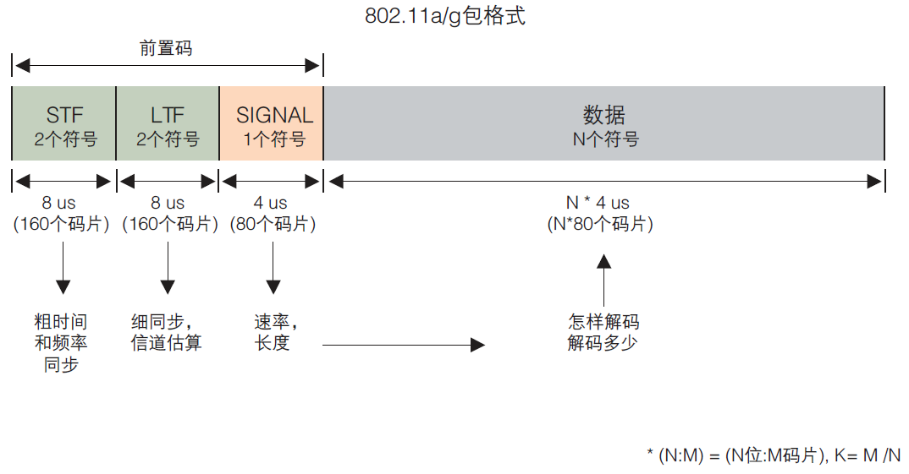
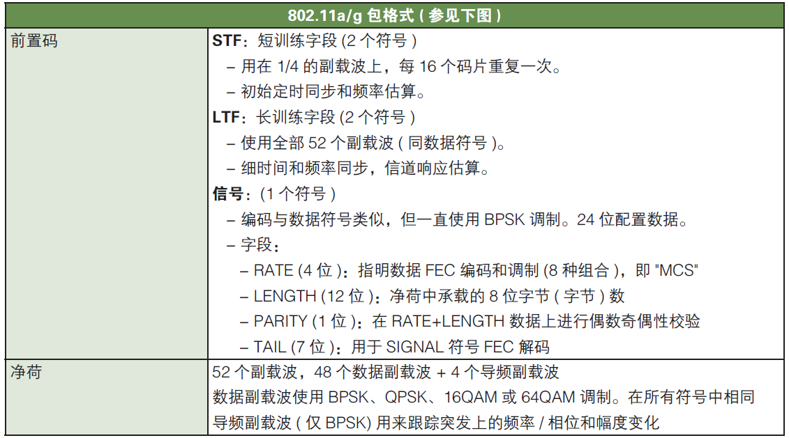
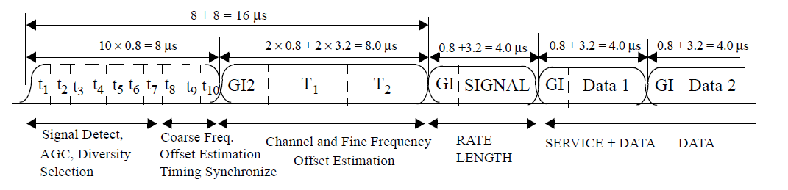
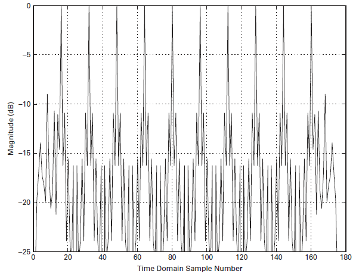
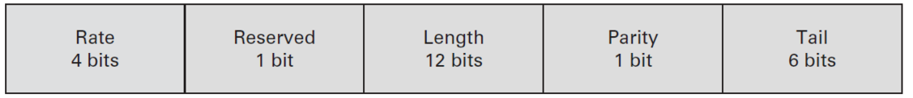
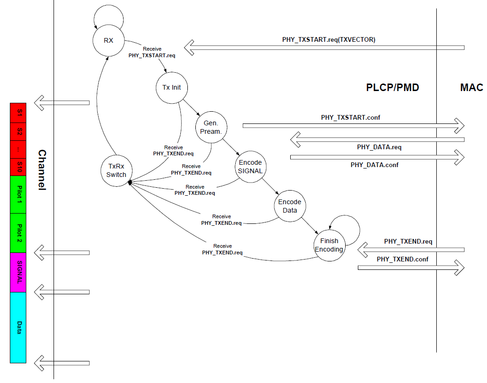
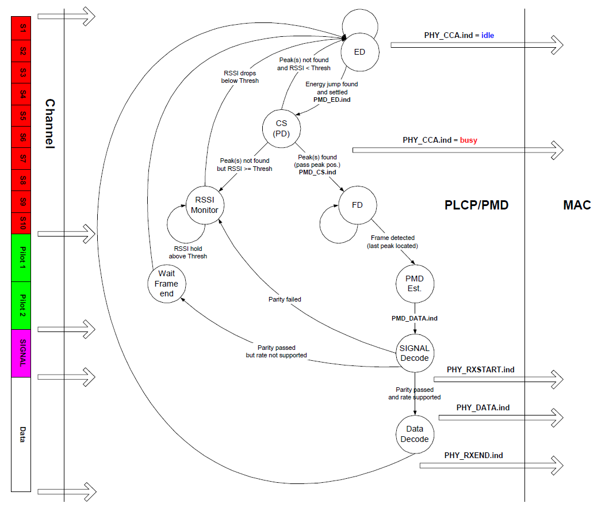

# 802.11协议精读7：802.11a/g的发送过程与接收过程

转载自: [802.11协议精读7：802.11a/g的发送过程与接收过程 - 知乎](https://zhuanlan.zhihu.com/p/21485216)

## 序言

我们之前描述了 802.11b 的发送和接收过程，802.11b 是基于 DSSS 模式下的，这一篇我们关注下基于 OFDM 的 802.11a/g 的发送和接收过程。同样主要是参考IEEE 802.11 Tutorial（Mustafa Ergen），我们对这一块进行整理。对于 802.11n/ac 以及其他的新协议，这一块过程上应该是更复杂一些，但是这份整理中还未涉及，所以整理中并未包含。

## 802.11a/g: 物理层头部

为了理解 802.11a/g 中的发送和接收过程，我们首先需要对其物理层的头部进行一定的理解。相比 802.11b 的物理层头部，802.11a/g 较为复杂一些。在 802.11a/g 的物理层头部前面有三个部分，一个`STF`，一个`LTF`，还有一个`SIGNAL`，即`短训练字段`和`长训练字段`以及一些具体的设置，如下图（图参考自泰克的文档）

!!! note

    这里需要指出的是在 802.11a/g 中，整个物理层头部都叫做 preamble ，与 802.11b 中的 PLCP Preamble 的概念不同，这里就对于 PLCP 和 PMD 子层有非常明确的分界，所以还需要注意一下。

其各个部分对应的功能如下：

在协议原版中，对这一块有更细致的描述，如下图（07版协议第600页）

在 802.11a/g 的物理层头部中，第一个部分为 STF（Short Training Field），STF 主要是由 10 个短的 symbol组成（t1~t10），其每一个 symbol 是 `0.8us`，其包含了很多个功能，其中 t1-t7 主要是包含 Signal Detect，AGC，Diversity Selection，t8-t10 主要是包含 Coarse Freq，Offset Estimation，Timing Synchronize，其中部分内容我们不进行展开了。

一般情况下，我们认为 STF 主要的两个功能是：

- 帧同步【即判断有没有一个数据帧到达，从而寻找SFD（Start-of-Frame Delimiter）】

- 粗频率同步，这里主要是针对频率偏移所做的一个同步的工作，同时也正好是对应后面的细频率同步的阶段（即 LTF 阶段）

我们在 DCF 的部分下，提到 CCA 中存在一种载波侦听 CS 的方式，其主要就是基于 t1-t10 这个部分的自相关或者互相关来完成的，如下图（参考Cambridge.Next Generation Wireless LANs.802.11n and 802.11ac）：

横轴是采样点数，纵轴是幅度，这里并没做归一化，这里可以数出来一共有 10 个尖峰，和这里 t1-t10 的数量一致，一般识别到一个尖峰后，STA 就认为信道里面是有数据帧正在被传输的，从而完成 CS 的检测。一般情况下，为了避免时延扩展的影响，这里采用自相关的效果会比互相关好一些。同时有关频率估计这一块，由于和本文主旨关联不大，所以不进行展开了。

第二个部分是 LTF（Long Training Field），其主要功能是**细频率同步**和**信道估计**。
从结构上而言，LTF 一种是三个部分: 1) GI，即保护间隔，用来防止 ISI，即符号间干扰。2) 两个独立的长训练 symbol，T1 以及 T2。

SIGNAL部分在Preamble的最后一个部分，其结构如下

首先 `Rate` 是标识数据包的传输速率的，即采用什么调制方式，编码速率，一般协议中直接所述标识了 MCS 值（MCS对应不同的速率），这里一种 4 个 bit，实际上可以标识为 $2^4$，16 个速率，实际上使用为 8 个。然后 `Length` 位是标识了数据包（具体payload）的长度，这里没有什么特殊的地方，与 802.11b 的前面不同，802.11b 那里是传输数据包的时间，而 802.11a/g 的情况下是长度。tail位是有个时候为了做FEC的，具体与卷积编码有关，在 802.11a/g 中，数据包头部和payload是分开来编码的，所以在头部有一个tail部分，payload体中间也有一个tail部分。通常这个部分设置成逻辑“0”。最后是reserved和parity部分，通常情况下，parity是用来做偶数奇偶性校验的。由于这里parity只有1位，所以在噪声比较大的情况下，很容易发生误识别的问题。所以在这一些设计中，把reserved位当做parity的一个扩展。同时，在802.11a/n混合模式中（这里由于802.11n也可以定义在5G频段），这里也有使用reserved位来维护一个协议的后续兼容性，即采用reserved来表示这个是一个802.11n MF Frame（PS：MF即是mixed format）。其余的一些补充可以参考（有关802.11a/g物理头：Premble结构，有关802.11a/g物理头：STF部分，有关802.11a/g物理头：LTF部分，有关802.11a/g物理头：SIGNAL部分），基于这些预备知识，我们下面描述802.11a/g的发送和接收过程。

## 802.11a/g: 发送过程

总体结构上而言，802.11a/g 和 802.11b 的发送过程基本变化不大，有些相同的部分我们会简化一些描述。

1. 初始是Rx状态，

   若收到上层的 PHY_TXSTART.req(TXVECTOR) 信息，则 PHY 层转换到 Tx Init 状态，在 802.11a/g 的 TXVECTOR 和 802.11b 中基本一致。

2. 当成功转移到 Tx Init 状态后，下一个状态是 Gen. Pream. 状态，

   这一步是用来产生 preamble 的，不过在该图中，这里主要是完成封装 preamble 中的 STF 和 LTF 两个字段的工作，即对应左图中的红色 S1-S10 部分，以及绿色 pilot1-pilot2 部分，由于这份资料较早，故直接采用了pilot这个说法，当前在 802.11a/g 中，pilot主要指的是用以信道估计的专用导频子载波，LTF 也有这样的功能，主要一个是在传输前所使用，一个是在传输中所使用。这里同时 PHY 会向 MAC 层反馈 PHY_TXSTART.confirm 信息。

3. 当转移到 Encode SIGNAL 状态后，这里是对 preamble 中的 singal 字段进行封装，其字段内容在之前我们已经提到过了，所以这里就不展开了，实际上和 802.11b 中的 PLCP Heade r部分是一致的。

4. 当接收到从 MAC 层发送过来的 PHY_DATA.req 之后，PHY 转移到 Encode Data 状态，对数据进行发送，直到上层数据发送完毕，MAC 层会传递来 PHY_TXEND.req 信息，从而 PHY 层会根据该信息转移至TxRx Switch状态对天线的工作机制进行转换。同时在传输过程中，任何一个状态也都有可能由于收到 PHY_TXEND.req 信息，而直接转移至 TxRx Switch 状态，这一点与 802.11b 中应该一致。若最终发送完成后，转移为 Rx 状态，并等待下一次传输。

## 802.11a/g: 接收过程

在 802.11a/g 的接收过程中，基本结构和 802.11b 的类似，细节存在一些区别。

1. 在Rx状态下，首先节点还是通过 ED 和 CS 的方式判断信道是否空闲，以及有没有对应的数据帧在信道中进行传输。

    如果CS检测到的话，那么可能就存在一个数据帧，那么需要再次通过 FD 来确定是不是一个数据帧，我们前面提到过，在 802.11a/g 中都是以`相关的方式`检测的，而不像 802.11b 中是采用 `SFD 的方法` 检测帧起始部分的，所以在 FD 检测的时候，会不断的循环检测，直到找到最后一个跳变的位置（即last peak located），那么才检测到一个帧起始。若 CS 检测失败的话，与 802.11b 相同，其会根据能量检测判断信道是否空闲，只有信道空闲时，才会转移为 ED 模式。在Rx状态下，当信道 busy 时，PHY 会向 MAC 通过 PHY_CCA.ind 反馈busy，当转移回 ED 状态时，PHY 会向 MAC 反馈 idle。

2. 当FD识别到数据帧起始之后，转移入PMD Est.状态，

    这个状态貌似不是一个参数，且Est.应该是establish的意思，这里原始协议中没有直接采用过这个词组，而是在句子里面大致这样说过。在PMD Est.状态之后，通过传递 PMD_DATA.ind 参数，PHY 开始处理 SINGAL 字段，其首先对其进行奇偶校验，这里没有采用 802.11b 中的CRC的方式，也许是为了简化一些。当解析成功后，提取解调数据所需要的MCS值，数据包大小等相关信息用以对上层数据包进行解析。若奇偶校验失败，则停止这一轮的传输，等待信道空闲后重新开始。

3. 当成功解析到了SIGNAL字段之后，PHY 层会对其数据字段的传输速率是否匹配进行判断，如果该速率是支持的话，那么转移至 DATA Decode 状态。若数据速率不支持的话，那么意味着无法解调，这里由于STA已经通过SIGNAL字段知道的数据包的大小以及传输速率，所以能够计算出数据包传输所需要花费的时间，从而就没有转移至RSSI Monitor 状态，而是转移至 Wait Frame End 状态，等待对方释放信道，类似 NAV 的工作模式，等待计时为0时，转移回 ED 状态。

4. 如果SINGAL字段解析成功，且速率匹配的话，那么就正常接收数据包，并反馈给 MAC 层 PHY_RXSTART.ind 信息，最终当数据接收完毕之后，反馈给上层 PHY_RXEND.ind 信息，然后回到初始状态。

