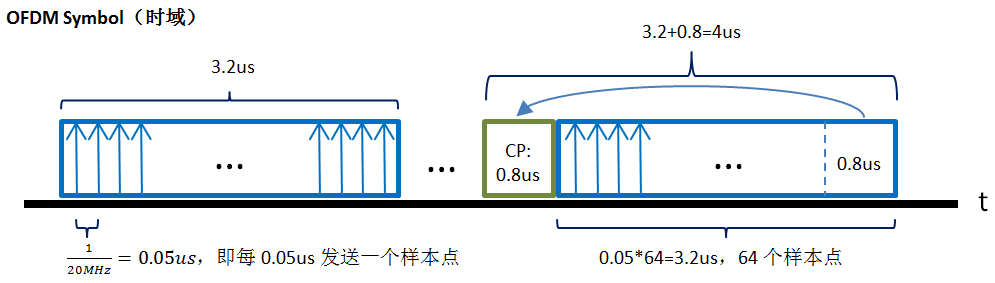

# 802.11协议精读8：再论802.11a/g的发送过程与接收过程

转载自: [802.11协议精读8：再论802.11a/g的发送过程与接收过程 - 知乎](https://zhuanlan.zhihu.com/p/21496609)

## 序言

我们之前描述了 802.11a/g 的发送和接收过程，都是基于协议表述上下层的交互机制的角度来描述的，而没有关注物理层获得数据帧之后，如何发送这样一个具体的流程，这一篇我们再对 802.11a/g 的物理层发送和接收过程进行一些扩展。这里主要是参考**《Cambridge.Next Generation Wireless LANs.802.11n》**这一本书上面的描述，我们对这一块进行整理。

!!! note

    目前我们的整理中还在尽量避免一些复杂的公式和表述的方法，希望先以简单的概念和流程先进行整理，至于一些细节部分可能之后有时间在独立整理，所以如果存在细节表述不对的地方，还请见谅。

## 802.11a/g：OFDM Symbol和OFDM Subcarrier

为了理解 802.11a/g 物理层的发送和接收过程，我们首先需要对其物理层的一些基本知识做一些简单的理解。

在 802.11a/g 协议中，其物理层是采用 OFDM 技术（Orthogonal Frequency Division Multiplexing），OFDM技术这里我们不做过多的展开，不过为了理解后文，我们需要明白两个概念，即 `OFDM 符号 (OFDM Symbol)`以及 `OFDM 子载波 (OFDM Subcarrier)`，前者主要是在**时域**的角度而言，后者则对应**频域**。

首先我们理解下 `OFDM symbol`，如上图蓝色部分所指（该图见07版协议595页，同时红色方框在后文处所用，这里并没有关联），我们可以发现，在 802.11a/g 中，其最终描述物理层帧的时候，并没有采用 bit 作为基本单元，而是采用 OFDM symbol 作为基本单元，这也是我们所需要接受的一个概念，在 802.11 中，若其信道的带宽固定，比如规定是 20MHz 的信道带宽，且由于其子载波数也是定值，那么其 OFDM symbol 的大小也就是固定的了。

我们下面具体以 802.11a/g 的一个 OFDM symbol 举例进行解释：

上图我们描述了两种 OFDM symbol，一种是不带CP（循环前缀），为图中左边部分，该 OFDM symbol 占时长**3.2us**，一种是带CP（循环前缀），为图中右边部分，该 OFDM symbol 占时长**4us**。图中的蓝色箭头代表发送的样本点，在 20MHz 信道带宽的情况下，其每 0.05us 就发送一个样本点，一个 OFDM symbol（不包含CP）一共包含了64个样本点，这64也代表着发送和接收过程中，都是以64个点为一个组合，进行一次处理，而不是一个个点单独处理，所以在 802.11a/g 下，其基本单元都是 OFDM symbol，而不是关注一个个采样点。同时为了减少通讯环境的影响，通常会在这 64 个样本点之前还添加一段 CP，该 CP 是将原来OFDM Symbol的最后一段，复制到该Symbol的头部之前，用来避免由于时延扩展所造成的码间串扰以及载波间干扰（在协议中，CP和GI（Guard Interval）是在同一个位置添加的，我们可以理解成，利用 CP 来填充 GI）。

接着我们需要了解下 802.11a/g 在频域上所对应子载波的结构。在 802.11a/g 中，实际上一共有 64 个子载波，如下图我们具体看下 OFDM 子载波的结构：

如上图所示，子载波一共分成4个类型

- Null Subcarrier

    图中蓝色的箭头，用来做保护间隔的，没有承载任何数据，在左边（即频率较低的一侧）有6个Null子载波，在右边有5个Null子载波。

- Pilot Subcarrier

    图中绿色的箭头，用来估计信道参数并用在具体的数据解调中，承载的是特定的训练序列，一共有4个导频子载波。

- DC Subcarrier

    图中黄色的箭头，一般材料里面没有用这个词，这里仅仅是为了描述造了一个词，在子载波中心位置的DC subcarrier一般都是空置不用的，所以这里标识一下。

- Data Subcarrier

    图中红色的箭头，用来真实传递数据所用的子载波，在 802.11a/g 中，这种子载波一共有52个。

最后参考上图（参考《Supporting Real-time Wireless Traffic through a High-Throughput Side Channel》，貌似这张图表述的还不错，至于中间的ener），我们简单描述下以上 OFDM Symbol 和 OFDM Subcarrier 的关系，其两者主要是由于 IFFT/FFT 的机制进行关联的。在 802.11a/g 的系统中，发送机和接收机处理数据都是按照，64个一组处理一次这样的形式，而这个64个一组能够分辨实际上就是通过OFDM subcarrier这种频域上，各个子载波是正交的形式，所以可以独立并且同时进行处理。而发送机发送只能按照一个个样本点进行按序的发送，若按矩阵进行理解的话，一开始发送机是处理 $64\times 1$ 的纵矩阵，一次性处理64个点，然后通过IFFT计算，将这64个点（也就是对应64个子载波）转换为 $1\times 64$ 个样本点，这64个样本点就构成了时域上的一个OFDM Symbol，其中每一个样本点都包含了原来64个点的部分信息，只有在接收方接收完这64个点之后，才可以进行一次逆运算（FFT），重新转换为 $64\times 1$ 的矩阵进行处理，最后接收方才可以对数据进行正确的接收。有了这些预配知识以后，我们后面开始描述一些物理层的发送和接收过程。

## 802.11a/g：物理层（PHY）的发送过程

相比之前描述的 802.11a/g 的流程，我们接下来描述的内容是当物理层的数据帧中，STF，LTF以及SIGNAL字段都已经封装好之后，接下来物理层发送流程的一些细节。我们用上图来描述一个物理层具体的发送过程：

1. 首先当正式的数据字段从MAC层下到物理帧之后（PLCP Header部分已经处理完了），会被增加三个部分：service，tail以及pad bits（这里可以关注第一部分描述OFDM symbol图中红色方框部分），这里需要注意的是，service字段虽然属于PLCP Header的内容，但是其是在DATA部分以高速率进行发送的，其余tail字段是为了卷积编码所使用的，pad bits是我们所述802.11a/g物理层都是基于OFDM symbol的，所以当symbol中数据字段不够的时候，需要填充空白字段，从而才能够生成OFDM symbol。

2. 在添加完三个部分之后，数据帧需要经过扰码器（Scrambler），扰码器的初始状态是通过service字段获得的，同时service字段实际上是通过MAC层传递下来的TXVECTOR参数获得的，在整个传输过程中，发送机和接收机需要采用相同的扰码序列。

3. 当扰码结束后，依序进行卷积编码（Conv. Encoder，用以增加冗余），用比特组成码元（Group bits into symbols），交织器（Interleaver，用以避免相邻的bit受到相同的频率选择性衰落的影响），然后对数据进行调制并映射到相应的子载波上（Modulator / Mapper），需要注意的是这里一般调制的数据都是复数，按笔者理解这里应该就是IQ相位进行的调制，所以在调制器模块之后，都是并发两个输出指向下一个模块。

4. 在数据部分完成之后，接着是插入4个导频码（Insert Four Pilots），用来在导频子载波上使用。

5. 当准备工作完成之后，进行IFFT变换（IFFT），生成一个OFDM Symbol中的一个个样本点，在802.11a/g中，一共有64个样本点。然后将该64个样本点对应的后1/4（即后面的0.8us），复制到symbol之前，从而构造了一个带CP的OFDM Symbol（Prepend Cyclic Prefix）。

6. 为了满足协议中spectral mask的要求，需要对每一个OFDM Symbol使用脉冲整形函数（Pulse Shaping Filter）进行平滑，以减少频谱旁瓣的干扰，实际上这里可以理解成是添加了一个升余弦滤波器做了一些处理。在《Cambridge.Next Generation Wireless LANs.802.11n》一书中，有给出推荐的整形函数的公式，这里就不展开了。

7. 最后通过DAC生成模拟波形，经过混频，功率放大器PA，最终通过天线发送出去，那么一个发送过程基本就结束了。

!!! note

    下图是参考《MIMO-OFDM Wireless Communications with MATLAB》一书中，OFDM Symbol经过脉冲整形之后的时域结果，这里只是给出一个直观的感觉，对于参数本文并不展开。

    

## 802.11a/g：物理层（PHY）的接收过程

对照 802.11a/g 的发送流程，我们接下来描述对应的接收流程。在上图所描述的接收流程中，STF，LTF 以及 SIGNAL 字段的使用是被包含在内的。

1. 在接收信号一端，信号经过低噪声放大器LNA，混频之后，接收机首先通过 STF 和 LT F字段完成初期的 AGC，频率校正（Frequency Correction），以及码元定时校正（Symbol Timing Adjust）的相关功能。同时在数据帧头部的 SIGNAL 字段中，也提供了上层解调所需要具体的 MCS 值，数据帧长度等相应信息，上图并未体现，不过这个部分信息也是需要在接收过程初期就需要获得的。

2. 在这之后，对接收序列进行串并转换（Serial to Parallel），实际上可以理解成累积采样点的过程，然后移除每一个OFDM Symbol的保护间隔CP（Remove Guard Interval，这里CP和GI的位置是一致的，协议表述一般为GI），然后进行对这些采样点序列进行FFT变化，转换为频域子载波进行处理。

3. 在FFT之后，利用 LTF 字段以及导频 Pilot 的相应信息对 OFDM Symbol 再一次进行一些细致的处理，包含信道均衡（Channel Equalizer），导频追踪和相位校正（Pilot Tracking & Phase Correction）以及处理一些解码所需要的可靠性的信息（Reliability information for decoder）。

4. 接着要按序进行解映射（Demapper）和解交织（De-Interleaver）的工作，据《Cambridge.Next Generation Wireless LANs.802.11n》一书所言，802.11a 系统是采用BICM（Bit Interleaved Coded Modulation）的方式完成解映射，解交织的相应工作，这一块笔者也没有深入看过，故先了解与一下。

5. 当以上的内容处理结束后，数据就需要被进行并串转换，从而从之前的OFDM Symbol，一个个按照一组采样点的处理方式，变成按照数据流的处理方式。然后经过解码获得解调之后的数据流。这里实际上还是存在非常多的细节部分，但是本文并没有对此进行展开，还请见谅，有部分内容扩展到也可以参阅原书。

6. 当解码之后，最后一个步骤是解扰码。接收机通过数据帧中携带的service字段作为解扰器的初始状态，从而一次解扰整个数据流。

!!! note

    本文主要简单叙述了 802.11a/g 物理层接收和发送过程的一些流程，因为本文主要关心是物理层发送和接收的总体流程，所以避免了一些具体过程的内容，比如没有过多展开说明 OFDM symbol 时域和 OFDM Subcarrier 之间的关系，CP，GI以及64样本点以及FFT/IFFT的关系之类也有点不明确，后续解调的一些细节也一带而过，同时为了简化，部分概念也不是表述很好，可能也有一些错误，导致部分表述存在问题，故还请见谅，有错误还请指出，谢谢。

