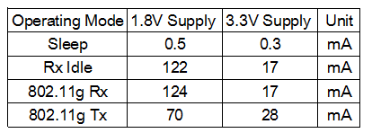
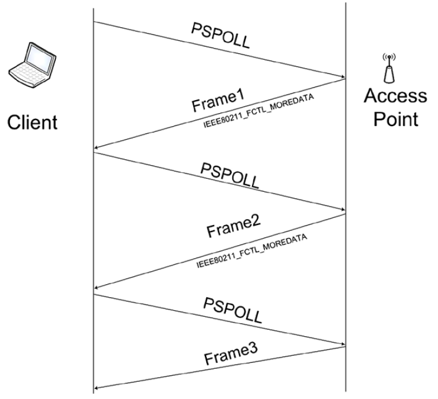

# 802.11协议精读9: 初探节能模式(PS mode)与缓存机制

转载自: [802.11协议精读9: 初探节能模式(PS mode)与缓存机制 - 知乎](https://zhuanlan.zhihu.com/p/21505178)

## 序言

由于 802.11 的协议工作机制，如果一直处于工作状态下，那么能耗还是比较大的，尤其移动设备的电量有限，所以在 802.11 协议初期就设计了相应的 **能耗管理机制**，即引入了**节能模式**。本文我们主要讨论一下其节能模式的一些基本思想和相应的组件。对于具体的 MAC 层工作机制，我们在后续的文章中在进行展开。

!!! note

    本文初始的意图是描述在节能模式下具体的MAC层工作机制，不过后来在写缓存结构的时候，发现内容整理还是较多，所以进行分拆。故在本文中，我们主要描述了 802.11 协议中，节能的基本思想，以及其所添加的一些组件，具体的MAC协议之后再进行补充。

## 802.11协议中的能耗

为了理解 802.11 节能机制，我们首先需要梳理一下 wifi 中的一些所出现的能耗。通常情况下，802.11 设备一共会有4个工作状态：

- Sleep（休眠模式）：节点会关闭发送和接收模块进行休眠，从而能耗最低。

- Rx Idle（接收空闲状态）：节点对信道进行监听，但并未真实接收数据帧。

- Rx（接收状态）：节点监听到数据帧，并对其进行接收。

- Tx（发送状态）：节点发送数据帧。

其中 Rx Idle 状态，Rx 状态和 Tx 状态的关系，需要从我们之前描述的发送/接收过程来理解。

1. 节点需要首先执行 CCA，用以监听信道中有没有数据帧（主要是 ED 和 CS 两个过程），这个过程即是 Rx Idle 状态。Rx Idle 状态下面可以转移至 Rx 状态，也可以转移至 Tx 状态。

2. 若节点在监听信道过程中，发现有 802.11 的数据帧，那么其就转移至 Rx 状态进行接收。

3. 若节点本身有数据需要发送，且在持续监听信道的过程中（即backoff过程中），发现信道是空闲的，那么其就转移至 Tx 状态进行发送。

在上述过程中，真正有用的只有 Rx 和 Tx 状态。但是实际过程中，为了保证接收与发送中没有冲突，节点需要长时间处于 Rx Idle 状态，从而会消耗很多能量。一般意义上，Rx Idle 状态近似于 Rx 状态，只是一个少了一些上层的逻辑处理工作，而能耗较大的 RF 模块，LNA，AGC 这些都是同样需要工作的。所以在 802.11 协议设计中，需要引入 `Sleep休眠状态` 以代替 Rx Idle 状态，达到节能的目的，进而扩展成了休眠模式下的工作机制。

下图给出了一般 wifi 芯片中，这四种模式的功耗情况（参考《AR5213_Data_Sheet_0704》中第10.1.5 Power Consumption 节）

该图所描述的都是工作在 802.11g 的模式下，为了更好的描述主题，我们对原图进行了一些裁剪，其余工作模式的功耗还请查阅原文。上图分别列举了 AR5213 这块芯片，在 1.8V 的供电模式和 3.3V 的供电模式下，对应的不同的功耗。可以明显看出，Sleep状态 和 其他几个状态 的功耗还是有很大差距的，从而节能模式如果设置的好，那么的确可以达到一个很好的节能效果。

同时，上图只是给出了一个标准 Tx 的功率大小，在 802.11 中还存在 transmit power levels 参数，一般有 8 个级别，可以调节具体的 Tx 功率。同时在beacon 帧中，也可能会添加 Power Constraint element 与 Power Capability element 这些参数，从而对该区域内的节点功率进行约束。这些都会影响具体的 Tx 功率大小，不过由于这些机制主要用于 TPC(Transmit Power Control) 机制，而本文讨论主要是节能机制，所以就不展开了。

## 节能模式的基本思想

按照之前我们的叙述，在 802.11 中功耗最大的部分是在 Rx Idle 状态。如果能够减少 Rx Idle 状态的持续时间，那么节点就可以节能了。在本章节讨论中，由于不讨论具体的 MAC 机制，所以我们简单假设一个拓扑，该拓扑仅包含一个 AP 和一个节点。节点上行发送都是发往 AP 的，下行是 AP 发往节点的。故从节点的角度而言，执行 Rx Idle 的目的则有两种可能性：

- 如果节点是为了发送数据，那么 Rx Idle 是用来监听信道的，从而如果没有数据发送，那么就不进行监听，从而就可以减少 Rx Idle 的持续时间了，这个还是很容易做到的。

- 如果节点是为了接收数据，那么 Rx Idl e则一定需要长时间持续进行。因为作为接收方，节点无法知道 AP 什么时候发送给自己的下行数据，所以要不断的监听信道，保持 Rx Idle 状态，对于每一个数据包都不能漏。由于节点无法控制AP，所以这一块是比较难做到的。

所以在 802.11 中就提供了一种被动请求机制，其主要就是提供了一种机制，让节点可以控制 AP，让其发送对应的下行帧给自己。故在节能模式下，802.11协议中就引入了两个机制：

- 缓存机制：这里缓存的主要是 AP 发往节点的数据。当 AP 从外网接收到要转发给节点的数据后，会将以 MSDU 的形式（即 MAC 层的数据帧）进行缓存（这里仅仅对工作在节能模式下的节点数据进行缓存），并不直接发送给节点。

- PS-Poll机制：若节点想要获取下行数据，那么节点需要主动跟AP请求数据，该请求帧就是 PS-Poll 帧。AP接收到该帧后，会检查缓存区是否有对应该节点的缓存，如果有就会从缓存区中调出对应该节点的缓存数据，并进行下发，如果没有则反馈一个 NULL 帧（既空数据）。有的书中，也将这个请求机制比较形象的描述为“乒乓”机制。

我们用下图大致描述下这里其交互机制：

1. 由于 AP 已知节点工作在节能模式，所以其首先将发送给节点的数据进行缓存。

2. 当工作在节能模式的节点 wake-up 后，其在完成竞争后，首先发送 PS-Poll 帧向AP请求下行数据帧。

3. AP从而就在自己的缓存区里面找该节点的缓存数据。当找到对应数据帧后，通过 Frame 进行反馈，这里可以看到上图标注了一个 `IEEE80211_FCTL_MOREDATA `的描述，该参数实际上对应到无线数据包中的`more data`字段.

4. 如果节点识别到该more data字段为1后，则知道 AP 中还有自己的缓存数据，那么会再次发送 PS-Poll 帧进行请求。

5. 直到 AP 反馈的 Frame 中的 `more data` 字段为0，那么节点就不会继续反馈 PS-Poll 帧。该轮的数据请求就结束了，从而继续 sleep 进行省电。

!!! note

    上图简单描述了节能模式的基本工作原理，其中我们省略了 ACK 的过程，以及在多节点情况下的具体工作机制，之后我们再进行补充。上述表述如果有错误的地方，还请见谅。

## 缓存机制

这里我们大致谈论下 AP 对于下行数据的缓存机制，首先笔者对这一块也没有完全的理顺，尤其是协议与内核实现机制这一块，貌似并不是完全按照协议的定义来实现的，所以这里只是一些简单的列举。如有错误还请指出，以便将这一块更加理顺一些。

**协议中对于缓存机制的描述（参考 802.11 协议 07/12 版本）**

在协议中，对于该buffer的描述还是较为复杂的。为了表述缓存，我们首先要描述在 802.11 协议中，对于一个帧如何存放是怎么定义的。在802.11协议中，数据帧的存放是通过FragSdu结构体进行存放的。（细节见 07 版协议第 805-806 页）

在这一段中，我们按照标注的顺序进行描述。

- 红色部分的1，这个部分描述了这整个模块的功能，是用来描述一个分段支持类的。然后在这个类下面，定义了3个子模块（图中只有2个，还有一个与节能模式有关所以放在后面描述）。
- 红色部分的2，注释表明说明，这里定义了一个数组用来存放具体的数据帧的。
- 蓝色部分的1，标识部分即是该FragArray数组的具体定义。
- 红色部分的3，注释了FragSdu的功能，实际上整个发送缓存，无论是否有fragment都是按照FragSdu进行存储的，该FragSdu在实现上具体就是一个结构体。虽然名字是用来定义分片的SDU的，但是其中也写明了“Each SDU, even if not fragmented, is held in an instance of this structure awaiting its (re)transmission attempt(s).”，故即使该数据包没有分片，那么应该是按照FragSdu这种形式统一存放的。
- 蓝色部分的2，在FragSdu结构体中，主要存放这个具体数据包中对应的很多的参数。这些参数包含一些数据帧中具体的控制字段，我们以紫色方框的标注叙述其具体描述方法。在紫色方框这一行中，紫色1标注该变量名为psm，紫色2所标注变量类型是Boolean类型，紫色3所标注的字段是注释，标注该变量是描述该数据包是否发往节能模式下的节点的。在这一行表述中，如果该变量是1的话，那么就标识这个数据包对应的接收节点是工作在节能模式，反之则不是。之前在红色部分2所定义的FragArray数组，也是通过最后一行所定义的pdus参数，存放在FragSdu结构体中。

PS：因为本文是描述节能模式下的缓存机制，所以就没有对帧重组部分的进行展开，如果是帧重组的情况，那么主要起作用的是FragNum类型的3个参数和SeqNum类型的1个参数。

每一个帧是通过FragSdu来存放的，对于多个帧，在802.11协议中实际上是以一个队列进行存放，该队列即是`SduQueue`。在802.11协议中，发送缓存以及用来节能模式下的发送缓存都是一个队列的结构。在802.11协议描述中，其是首先定义了一个队列的类，然后在分段支持类进行对SduQueue进行了继承。首先我们查阅下Queue类的初始定义，如下：

在该Queue类中，其定义了两个方法，即 Qfirst(queue,item) 和 Qlast(queue,item)。其中 Qfirst(queue,item) 子函数负责把数据帧插入到队列首部，Qlast(queue,item) 负责把数据帧插入到队列尾部，在一些材料中，这里还所述定义了 first_and_tail 方法，不过笔者在协议中并没有直接找到。在分段支持类中，对Queue进行了继承，如下：

即增加了一个方法 Qsearch(queue,addr)，在节能模式下，当节点发送PS-Poll后，AP需要在缓存区查找出对应该节点的数据帧，再进行相应的传输。在这一段描述中，该 FragSdu 描述是为了 power save buffers 使用的，但是很多材料中所述，整个传输缓存就是按照 SduQueue 的形式存放的，这里笔者并没有严格考证过，最后我们用一张图大致描述下整个结构。

内核中对于缓存机制以及节能模式的描述（参考《Linux Kernel Networking》第12章部分内容以及openwrt的源码）
在内核中，对于缓存是在openwrt源码中\net\mac80211\Sta_info.h中定义的，如下图

其中 ps_tx_buf 就是用以节能模式下，存储节点的buffer的，其中IEEE80211_NUM_ACS参数一般设成4，其对应是802.11e中存在的4中不同优先级的队列，sk_buffer_head是一个结构体，其含义是一个链表头，一般该结构都是用来辅助sk_buff结构快速找到链表头结点的。具体实现中，应该是利用该链表结构实现了一个Queue，或者说是一个FIFO。

同时实现中，定义了一些有关buffer长度的限制，笔者目前整理一共有三处限制。

STA_MAX_TX_BUFFER：该参数大小是64（书上所述是128），是用来限制ps_tx_buf的带下的，位置在\net\mac80211\Sta_info.h中。该参数的意思是，每一个节点最多可以储存64个数据包。

AP_MAX_BC_BUFFER：该参数大小是128，是用来限制bc_buf的大小，位置是在\net\mac80211\Ieee80211_i.h。该buffer是专门用来存放组播/广播帧的，该buffer只有1个队列。

TOTAL_MAX_TX_BUFFER：该参数大小是512，根据描述，是用来限制总的buffer大小的，位置是在\net\mac80211\Ieee80211_i.h中。
PS：上述主要还是关注了下，AP中为节能模式所设定的缓存结构，具体的节能实现机制和MAC层协议，这里我们还没有展开，还请见谅。

## Wi-Fi System-Level 的节能

另外从系统的角度看节能的话，Wi-Fi也需要进行相应的参数设置，一般就是节能模式的开启或者关闭，以及调节DTIM参数之类。以下是一个参考，这里备注下。

