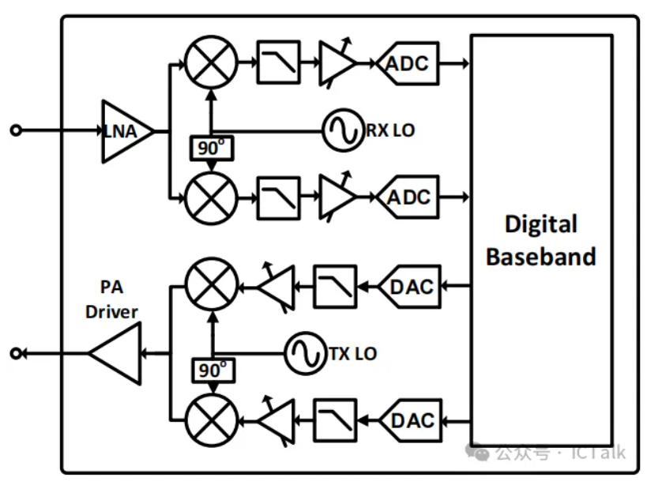
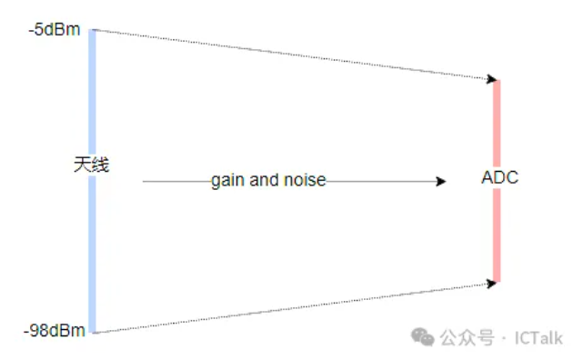
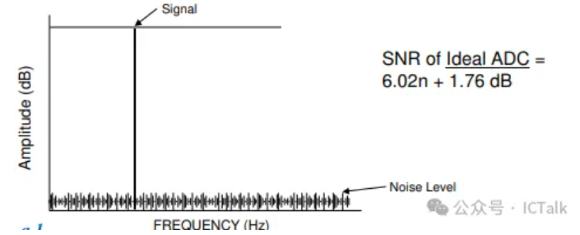
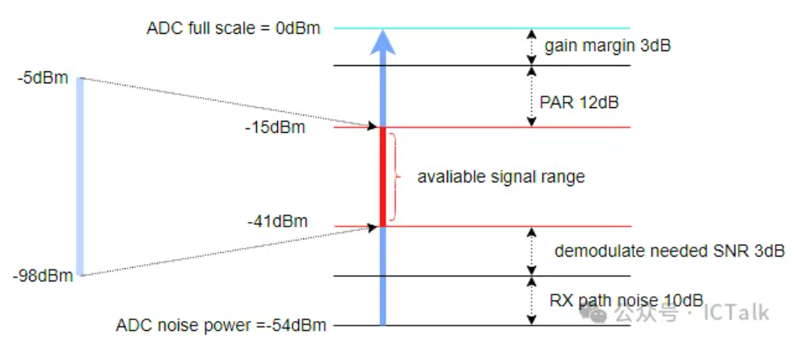
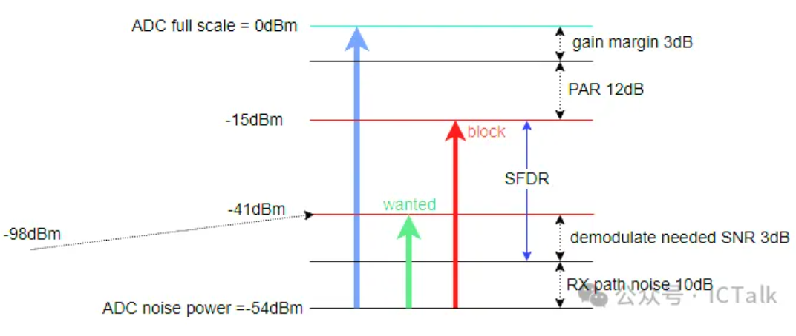

# WIFI接收链路ADC解析

**转载自**: [WIFI接收链路ADC解析](https://mp.weixin.qq.com/s/xJkzcR076PPkDLoZ0ElC1A)

对于 direct conversion radio 的 WiFi 接收链路，ADC 是与数字直接相连的模块，它将经过下变频的模拟信号转换成数字信号，然后交给 digital baseband 来进行处理，理解 ADC 的相关概念，比如 ADC 动态范围，SNR，SFDR 等对于数字的处理，特别是AGC系统设计会有帮助.

WiFi 接收链路是将天线端的信号经过一系列的转换变成数字信号从 ADC 端输出，假设最大接收信号为 `-5dBm`（当然有些系统可以达到  0dBm甚至正数），最小接收信号，也就是接收灵敏度为 `-98dBm`，中间经过 LNA，RMX，FILTER, VGA，信号从射频信号转换成基带信号，最后映射到 ADC 的动态范围之内.

理想的 ADC，其动态范围可以通过如下公式来计算，如果是 `10bits` 的 ADC，其动态范围为 `61.96dB`。

为了简单起见，假设  ADC full scale的时候允许输入的信号大小为 0dBm（该值可以通过ADC full scale对应的电压，电路匹配等计算得出），实际电路中，ADC不可能达到理想的动态范围，假设 10bits ADC 实际的有效 bit 数为 9，那么 ADC 能分辨的最小信号为 -54dBm 左右，同样还是以天线输入 $-5dBm ~ -98dBm$ 的信号范围为例：

- 整个接收链路的 noise（从LNA到ADC输入端）肯定会大于 ADC 本身的噪声，假设为 10dB

- 假设解调需要的信噪比为 3dB

- 假设接收链路的 gain variation 为 3dB

- 假设实际 OFDM 64QAM 的 PAR 为 12dB

那么我们可以大概算出来接收时需要将 ADC 的信号范围调节到 -15dBm~-41dBm 的范围内，由此我们可以算出整个链路的增益范围大概是+57dB ~ -10dB，也就是链路的增益范围为 70dB 左右.

以上我们没有考虑整个接收链路的 DC offset，过采样 对 ADC SNR 的提升以及block的影响.

在实际的接收链路中，block的影响不可忽略，block又可以分成 inband 和 outband，ouband 会被接收 Filter 滤掉很大的一部分，相对于 inband 的block来说影响不会这么大，但对于AGC来说依然需要考虑不同的gain调整策略，而对于 inband 的block，整个接收链路需要定义出一个允许的最大block值，在该block值的范围内，整个接收链路不会饱和，特别是 ADC，因此会引入 SFDR(spurious free dynamic range)，在这里不对SFDR作过多理论解释，比如基于单tone，基于双tone以及基于noise的分析，同样以上面系统为例，

假设天线端输入 **-98dBm** 的信号，此时所需链路增益为 57dB，经过接收链之后则得到的wanted信号为 -41dBm，系统有 3dB 的解调SNR，刚好可以解调，此时如果带内有一个block，该block同样也会经过57dB的增益，为了保证ADC不饱和，block最大不能超过-15dBm，则输入的最大block -72dBm，此时我们认为ADC的 SFDR 为 29 dBc

综上，可以看出，ADC 信号的有效范围，或者说 AGC 调整的信号大小，下限取决于信号的解调信噪比，也就是不同大小信号要在链路不同增益时保证信号在解调信噪比以上，上限则取决于block的大小，要保证同样增益情况下，带内的block不会导致ADC饱和，当然这个能容忍的最大block值是系统定义时自己确定的，没有统一标准（WIFI协议的标准相对比较松）

参考文献: **Assessing the ADC SNR and SFDR for Communications Systems**