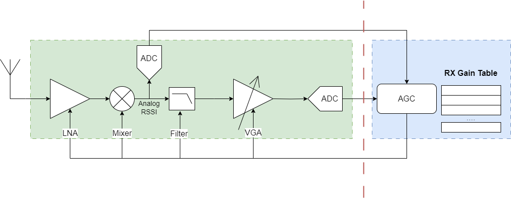

# WiFi 接收 AGC 浅析

**转载自**: [WIFI接收AGC浅析](https://mp.weixin.qq.com/s/l2M3d2CdTxaMKk1MN7d4tQ)

前一篇文章介绍了接收链路的ADC动态范围以及什么样的信号是合适的范围:

[WIFI接收链路ADC解析](https://mp.weixin.qq.com/s/xJkzcR076PPkDLoZ0ElC1A)

如何将信号调整到合适的范围就是 AGC 的工作，AGC 的控制模块在数字部分，需要调整的是接收链路的模拟射频部分的增益，在接收链路中，可以被调整增益的模块一般包括 LNA，MIX，Filter，VGA 等.

各个接收链路模块的增益大小都不一样，
一般来说 **LNA** 的增益档位相对比较大，比如 6dB 一档，所以整体档位比较少，
而 **VGA** 模块的增益档位比较小，可以是 1dB 或者 2dB 一档，一般用于细调，整体档位比较多。
同时，增益并不是只有放大功能，有些模块存在负增益，也就是缩小功能，对于大的信号，我们通过负增益将信号缩小，而对于小的信号则通过正增益来进行放大

比较常见的接收链路AGC架构如下：

除了常见的接收链路模块，还会有一个 `analog rssi` 的检测模块以及将 `analog rssi` 转换成数字信号的 ADC 模块，通常 analog rssi 检测模块位于接收链路的低频链路位置，也就是经过了 MIX 下变频之后的位置.

数字 AGC 模块得到 analog rssi 的值之后，通过查找 gain table，直接查出各个模块需要设置的gain的大小，然后直接设置到接收链路的各个模块中，在gain table设置准确的情况下基本上可以一次迭代完成整个链路增益的调整.

如果接收链路有block存在，AGC 的 gain table 设计需要有特别的考虑，当大的block出现时，LNA 和  MIX比较容易出现饱和，因为它们是 RF 前端会直接看到所有的block信号，一味降低 LNA 的 gain，noise figure 又会增大，会影响解调 SNR，所以一定要设置合理的 gain，只有这样才能保证实际环境中 AGC 能稳定工作，而数字看到的信号也是稳定的.

一般来说，初始状态下会将接收链路的 gain 设置到最大，目的就是为了能随时检测到比较小的信号，特别是灵敏度附近大小的信号.

!!! note "总结"

    - AGC增益调整的准确性依赖于模拟端给出准确的RSSI值

    - RX Gain Table 的设计在 RF 链路预算时就需要进行考虑

    - 针对有block的情况，需要给出不同的 RX Gain Table 设置

    - 对于是否存在block，数字端可以通过 inband power 和 outband power 来判断

    - 如有必要可以考虑对接收链路的增益进行校准，保证各个档位gain的准确性